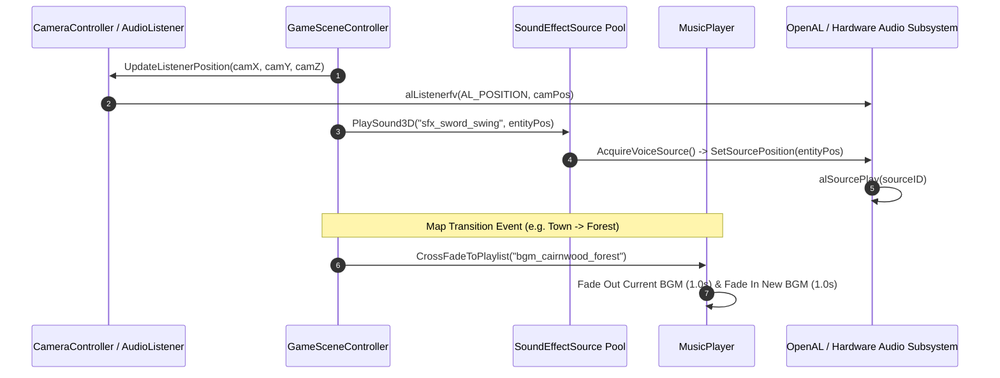

# Caver Spatial Audio Engine & Music Manager Documentation

## 1. System Overview & Purpose

The audio engine in Swordigo handles 3D spatial sound effect positioning, OpenAL audio buffer management, background music (BGM) playlist streaming, sound bank allocation, and volume attenuation (`Caver::AudioSystem`, `Caver::AudioPlayer`, `Caver::MusicPlayer`, `Caver::MusicPlaylist`, `Caver::SoundEffectComponent`, `Caver::SoundLibrary`).

This document details OpenAL buffer loading, 3D spatial attenuation formulas, BGM playlist cross-fading, and sound effect triggers for the C++ PC rewrite.

---

## 2. Namespace & Class Hierarchy (`Caver::*`)

```
Caver::AudioSystem (Master OpenAL / Audio Hardware Manager)
 ├── Caver::AudioListener (3D Listener Spatial Position Node - Camera Anchored)
 ├── Caver::SoundLibrary (Sound Effect Sample Buffer Cache & Preloader)
 ├── Caver::SoundEffectSource (Active OpenAL Sound Emitter Voice Pool)
 ├── Caver::SoundEffectComponent (Entity Sound Emitter Component)
 ├── Caver::MusicPlayer (BGM Stream Player & Cross-Fader)
 └── Caver::MusicPlaylist (Map BGM Playlist Track Container)
```

---

## 3. Spatial Audio & BGM Streaming Pipeline



---

## 4. Audio Attenuation & Stream Specifications

### 1. 3D Inverse Distance Attenuation Formula
Spatial sound effect volume $V(d)$ at distance $d = \|\vec{P}_{\text{emitter}} - \vec{P}_{\text{listener}}\|$:
$$V(d) = \text{Clamp}\left(\frac{d_{\text{ref}}}{d_{\text{ref}} + \text{Rolloff} \cdot (\max(d, d_{\text{ref}}) - d_{\text{ref}})}, 0.0, 1.0\right)$$

### 2. Audio Format Specifications
- **Sound Effects (SFX)**: Uncompressed 16-bit PCM WAV / IMA ADPCM buffers ($22.05\text{kHz} / 44.1\text{kHz}$ Mono for 3D positioning).
- **Background Music (BGM)**: Compressed OGG Vorbis stereo streams ($44.1\text{kHz}$ Stereo) looped seamlessly at pre-calculated sample loop points (`LoopStart`, `LoopEnd`).

---

## 5. Reverse Engineering & Tools Integration Notes

- **FileRift Asset Extractor**: FileRift extracts sound effect banks and background music tracks into standard uncompressed WAV and OGG Vorbis files.
- **SwKiWi Modding API**: SwKiWi exposes `AudioSystem::PlaySoundEffect` and `MusicPlayer::SetCustomBGM`, enabling custom audio mods and replaceer packs.

---

## 6. PC Port (`swd`) Implementation Strategy

1. **Modern OpenAL Soft / FMOD Driver**: Utilize OpenAL Soft (`libopenal`) or FMOD Core to support 3D spatial HRTF (Head-Related Transfer Function) audio positioning for headphones.
2. **Dynamic Audio Mix Channels**: Implement independent volume sliders in PC settings for Master Volume, BGM Volume, SFX Volume, and UI Audio.
