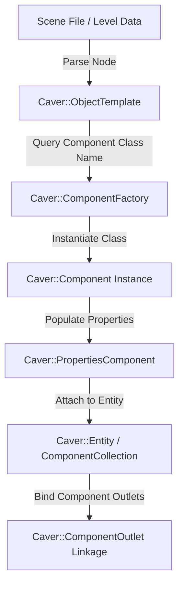

# Caver Entity Component System (ECS) Architecture Documentation

## 1. System Overview & Purpose

Swordigo employs a custom object-oriented Entity Component System (ECS). Unlike pure data-oriented ECS frameworks (like EnTT or Flecs), Swordigo's ECS utilizes component collection wrappers (`Caver::ComponentCollection`), component managers (`Caver::ComponentManager`), outlet binders (`Caver::ComponentOutlet`), and virtual lifecycle hooks (`OnUpdate`, `OnRender`, `OnCollision`).

This document details the architecture, component allocation pipelines, outlet binding mechanisms, and messaging buses for the C++ PC rewrite and native port (`swd`).

---

## 2. Namespace & Class Hierarchy (`Caver::*`)

```
Caver::Component (Base Abstract Component)
 ├── Caver::EntityComponent (Base Entity Lifecycle)
 │    ├── Caver::HeroEntityComponent (Player Entity)
 │    └── Caver::MonsterEntityComponent (Enemy Entity)
 ├── Caver::TransformComponent (Position/Rotation/Scale)
 ├── Caver::PhysicsObjectComponent (Physics Body Linkage)
 ├── Caver::CollisionShapeComponent (Collider Hierarchy)
 └── Caver::ModelComponent (Visual Mesh Representation)

Caver::ComponentManager (Container & Update Dispatcher)
Caver::ComponentFactory (Deserialization & Instantiation Registry)
Caver::ComponentCollection (Fast Vector Array Wrapper for Entities)
Caver::ComponentOutlet<T> (Reference Binding Pipeline)
```

---

## 3. Core Component Lifecycle & Messaging

### 1. Component Base Interface
```cpp
namespace Caver {
    class Entity;

    class Component {
    public:
        virtual ~Component() = default;
        virtual void OnAttach(Entity* parent) = 0;
        virtual void OnDetach() = 0;
        virtual void OnUpdate(float deltaTime) = 0;
        virtual void OnLateUpdate(float deltaTime) = 0;
        virtual void OnEvent(const GameEvent& event) = 0;
        
        Entity* GetEntity() const;
        bool IsEnabled() const;
        void SetEnabled(bool enabled);
    };
}
```

### 2. Component Collection & Fast Vector Wrapper
Entities maintain active components using template array containers (`FastVector_Caver_Component_`).
- **Insertion**: Fast O(1) push to back.
- **Outlet Linking**: Component outlets automatically register pointer references upon `OnAttach`.
- **Deletion**: Swap-and-pop pattern to avoid dynamic reallocation memory fragmentation during high entity activity (e.g. particle explosions, item drops).

---

## 4. Component Factory & Deserialization Pipeline



### Component Factory Registration
`ComponentFactory` maps string descriptors (e.g., `"CharControllerComponent"`, `"DoorControllerComponent"`, `"HealthComponent"`) to static creator callbacks. When a scene file is parsed, the factory generates the appropriate component instances and binds their field properties via `PropertiesComponent`.

---

## 5. Reverse Engineering & Tools Integration Notes

- **FileRift Integration**: FileRift's `.scene` and `.POD` parsers directly read the string component descriptors mapped by `ComponentFactory`.
- **Boulder Editor Integration**: Boulder operates as a level and entity editor. It manipulates `ObjectTemplate` and `ComponentCollection` hierarchies, serializing properties into XML/binary formats.
- **SwKiWi API Modding**: SwKiWi exposes `ComponentManager::RegisterCustomComponentFactory`, allowing custom C++ plugins to introduce new gameplay components at runtime.

---

## 6. PC Rewrite (`swd`) Implementation Guidelines

1. **Smart Pointer Refactoring**: Modernize raw pointers and legacy `boost::shared_ptr` to `std::shared_ptr` and `std::weak_ptr` for `ComponentOutlet` references to eliminate dangling pointer crashes.
2. **Dense Array Cache Locality**: Re-architect `ComponentManager` storage into contiguous memory pools per component type to improve CPU L1/L2 cache hits during update ticks.
3. **Type-Safe Messaging Bus**: Replace untyped `GameEvent` void pointers with strongly-typed compile-time event dispatches (`std::variant` or templated listeners).
