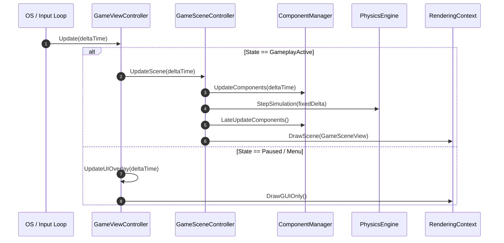

# Caver::Program & Application Lifecycle Documentation

## 1. System Overview & Purpose

The `Caver::Program` and lifecycle architecture forms the core execution foundation of Swordigo. It manages the main application lifecycle, delta-time execution loops, game state transitions, scene tree updates, view controller navigation stacks, and event distribution.

In the original Android/iOS native engine, the application lifecycle bridges operating system window events (via Touch/Keyboard drivers) to high-level game logic controllers. For the C++ PC rewrite and the native `swd` port, this module serves as the primary game loop and state driver.

---

## 2. Namespace & Class Hierarchy (`Caver::*`)

```
Caver::Proto::Program (Protobuf state representation)
 └── Caver::Program (Engine Runtime Instance)
      ├── Caver::ProgramState (State Register)
      ├── Caver::ProgramComponent (ECS Program Bindings)
      ├── Caver::GameViewController (Top-Level Game View & State Manager)
      └── Caver::GameSceneController (Level Scene Loop & Update Engine)
```

### Key Classes & Responsibilities
- **`Caver::Program`**: Main application state container. Holds global initialization configurations, execution tables, program state registers, and serialization logic.
- **`Caver::ProgramState`**: Encapsulates runtime application context, active execution flags, scene load requests, and global time multipliers.
- **`Caver::ProgramComponent`**: Connects low-level system lifecycle events into the Entity Component System (ECS).
- **`Caver::GameViewController`**: Main UI and game view controller managing profile loads, state restoration, menu view navigation stack, overlay dispatching, and pause management.
- **`Caver::GameSceneController`**: Drives active in-game scene updates, component tick pipelines, physics integration steps, and rendering queue submissions.

---

## 3. Data Structures & Logic Specifications

### Program State Context Structure
```cpp
namespace Caver {
    enum class EngineState {
        Uninitialized,
        MainMenu,
        ProfileLoading,
        SceneLoading,
        GameplayActive,
        Paused,
        GameOver,
        StoreView
    };

    struct ProgramStateRegister {
        EngineState currentState;
        EngineState targetState;
        float frameDeltaTime;
        float fixedTimeStep;
        float timeScale;
        bool isPaused;
        bool debugOverlayEnabled;
    };
}
```

### GameViewController State Machine
The `GameViewController` owns the active player profile (`PlayerProfile`), the active `GameSceneController`, and handles sub-controller callbacks:
- `GameMenuViewControllerDidQuitToMenu`: Tear down active scene, flush save data, transition to main menu.
- `PortalViewControllerDidGotoLevel`: Transition to new map node, trigger loading screen, deserialize level entities.
- `StoreViewControllerDismissed`: Resume active game loop and restore UI overlay.

---

## 4. Lifecycle Execution & Frame Loop



---

## 5. Reverse Engineering & Tools Integration Notes

- **Native SDK Integration**: Interfaced via `FWTouch` and `FWKeyboard`. Event handlers pass raw input structs directly into `GameViewController` action listeners.
- **FileRift Asset Format Reference**: Scene configuration files loaded by `GameSceneController` originate from uncompressed `.scene` definitions parsed via `ObjectTemplate` and `ComponentFactory`.
- **SwKiWi API Integration**: Modding API hooks hook into `GameViewController::LoadGameState` and `GameSceneController::Update` to inject custom entities and override player stats.

---

## 6. PC Port (`swd`) Implementation & Rewrite Guidelines

1. **Decouple Platform Touch Drives**: Replace touch event polling with standard GLFW/SDL mouse and keyboard / gamepad action mappers.
2. **Fixed Time-Step Loop**: Implement accumulative fixed time-stepping (`dt = 1/60s`) for physics simulation while maintaining variable interpolation for high-refresh-rate monitors (144Hz+).
3. **State Transition Safety**: Ensure level transitions safely flush smart pointer arrays (`boost::shared_ptr` replacement `std::shared_ptr`) before constructing new `GameSceneController` instances.
