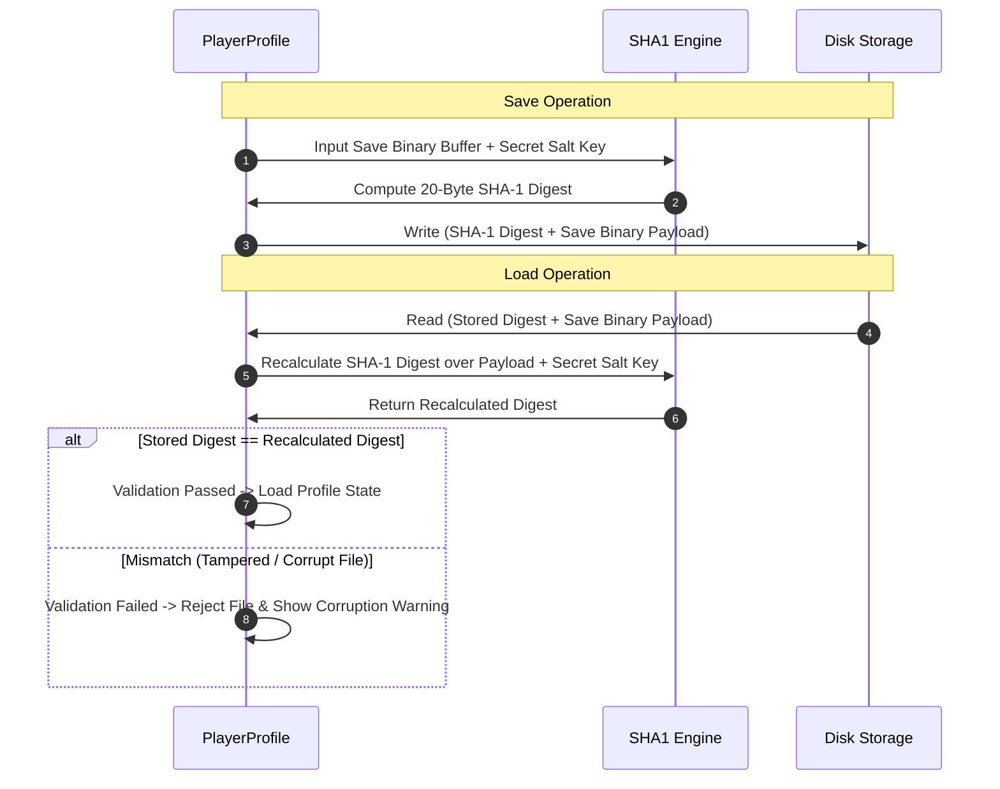

# Caver Cryptography, RNG & Save Security Documentation

## 1. System Overview & Purpose

The decompiled source in `GhidraDecomp src/misc/sha1.c`, `seed_rng.c`, and `uuids.c` details Swordigo's cryptographic hashing algorithms, pseudo-random number generator (PRNG) seeding, save file tamper verification checksums, and UUID generation routines.

This document details SHA-1 hash generation, PRNG seeding algorithms, save data integrity checks, and UUID formatting for the C++ PC rewrite.

---

## 2. Namespace & Cryptographic Utilities

```
Caver::Security
 ├── Hash: SHA1 (Secure Hash Algorithm 1 - 160-bit Checksum Generator)
 ├── Random: SeedRNG (Deterministic Linear Congruential PRNG)
 └── UUID: UUIDGenerator (128-bit Universally Unique Identifier Generator)
```

---

## 3. Save Tamper Verification & Checksum Pipeline

To prevent manual save file tampering or corrupt state loading, `PlayerProfile` calculates a 160-bit SHA-1 checksum digest over the binary payload prior to saving:

$$\text{Digest} = \text{SHA1}(\text{SaveBinaryPayload} \mathbin{\Vert} \text{SecretEngineKey})$$



---

## 4. Pseudo-Random Number Generator (`seed_rng.c`)

Swordigo uses a seeded Linear Congruential Generator (LCG) for deterministic gameplay rolls (item drop probabilities, critical hit chance, particle variance):

$$X_{n+1} = (a \cdot X_n + c) \bmod m$$

Where $a = 1103515245$, $c = 12345$, and $m = 2^{31}$.
- **RNG Seeding**: Seeded with `seed_rng(system_time)` on boot or set to fixed seed values during speedrun seed mode.

---

## 5. Reverse Engineering & Tools Integration Notes

- **GlossHook Integration**: GlossHook targets `PlayerProfile::ValidateChecksum` to bypass save validation checks during modding and save editing tests.
- **SwKiWi API Modding**: SwKiWi exposes `Security::CalculateSHA1`, enabling modders to hash custom mod assets for integrity verification.

---

## 6. PC Port (`swd`) Implementation Strategy

1. **Upgrade to SHA-256 Checksums**: Replace deprecated SHA-1 hashing with **SHA-256** for stronger save file security and integrity checks.
2. **Modern C++11 `<random>` Engine**: Replace LCG `seed_rng` with `std::mt19937` (Mersenne Twister) for superior statistical randomness quality in drop tables and particle systems.
