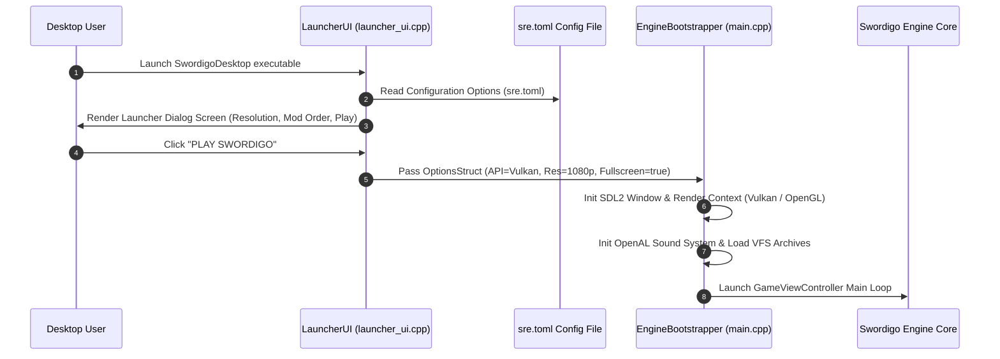

# Caver Desktop Launcher Architecture & Configuration Documentation

## 1. System Overview & Purpose

The Desktop Launcher (`src/launcher_ui.cpp`, `main.cpp`) serves as the entry point and UI configuration manager for `SwordigoDesktop` (`swd`). It provides an ImGui launcher panel for display resolution selection, graphics API backend switching (Vulkan vs OpenGL vs Direct3D11), mod manager load ordering, profile slot selection, audio driver setup, and crash dump handling.

This document details application initialization steps, graphics driver bootstrapping, mod manager UI, and crash dump telemetry for the C++ PC rewrite.

---

## 2. Namespace & Launcher Architecture

```
SwordigoDesktop::Launcher
 ├── LauncherUI (ImGui Configuration Screen & Profile Picker)
 ├── EngineBootstrapper (Graphics API & Subsystem Bootstrapper)
 ├── ModManagerUI (Mod Load Order & Conflict Inspection Panel)
 └── CrashHandler (Crash Dump & Signal Telemetry Recorder)
```

---

## 3. Application Initialization & Boot Pipeline



---

## 4. Graphics API & Sound Subsystem Selection Matrix

| Subsystem Option | Options Enum Value | Underlying Hardware API | Primary PC Platform |
| :--- | :--- | :--- | :--- |
| **Graphics API** | `GFX_OPENGL` | OpenGL 4.5 Core Profile | Linux / Windows Default |
| **Graphics API** | `GFX_VULKAN` | Vulkan 1.3 Dynamic Rendering | Modern GPU / Steam Deck |
| **Graphics API** | `GFX_DIRECT3D11`| Direct3D 11 | Windows Legacy Compatibility |
| **Audio Backend** | `AUDIO_OPENAL` | OpenAL Soft 3D HRTF | All Platforms |
| **Audio Backend** | `AUDIO_SDL_AUDIO`| SDL2 Audio Device Queue | Fallback Driver |

---

## 5. Mod Manager UI & Load Order Handling (`ModManagerUI`)

The launcher includes an integrated Mod Manager enabling players to toggle and reorder custom mods:

```
+-------------------------------------------------------------------+
|                        SWORDIGO MOD MANAGER                       |
|                                                                   |
|  Active Load Order:                                               |
|  [ ^ ] [ v ]  1. [X] HD_Textures_Pack_v2.0 (Textures Override)    |
|  [ ^ ] [ v ]  2. [X] Custom_Spells_Expansion (Lua Script Mod)    |
|  [ ^ ] [ v ]  3. [X] Speedrun_Split_Timer (UI Overlay Mod)        |
|                                                                   |
|  [ INSTALL NEW MOD (.zip) ]           [ SAVE & CLOSE ]           |
+-------------------------------------------------------------------+
```

---

## 6. PC Port (`swd`) Implementation Strategy

1. **Automated Crash Dumper**: Integrate Google Breakpad / Crashpad to automatically capture mini-dumps (`.dmp`) upon unexpected runtime segmentation faults.
2. **Steam Deck Profile Auto-Detection**: Detect Steam Deck hardware signatures (`SteamDeck = true`) to automatically select $1280 \times 800$ resolution, enable $60\text{Hz}$ V-Sync, and map controller UI hints.
