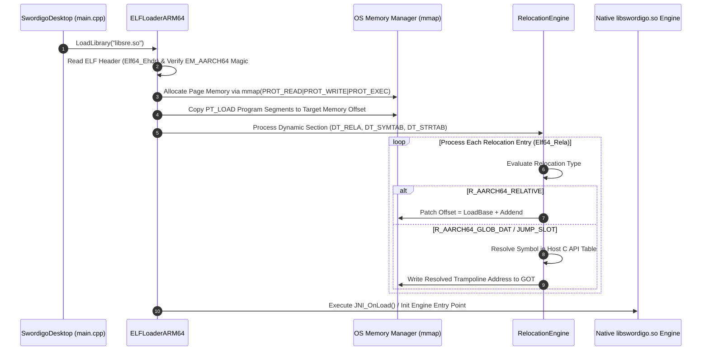

# Caver ARM64 ELF Binary Loader & x86_64 JIT Bridge Documentation

## 1. System Overview & Purpose

The ARM64 ELF Binary Loader (`src/loader/elf_loader_arm64.cpp`, `elf_loader.cpp`) is the core execution bridge of `SwordigoDesktop` (`swd`). It loads the original native ARM64 Android shared library (`libswordigo.so` / `libsre.so`) directly into memory on desktop x86_64 Linux/Windows systems without requiring full Android emulator emulation.

This document details ELF header parsing, dynamic relocation patching (`R_AARCH64_*`), executable memory mapping (`mmap`), GOT/PLT symbol resolution, and ARM64-to-x86_64 JIT trampoline bridging.

---

## 2. Namespace & Class Hierarchy

```
SwordigoDesktop::Loader
 ├── ELFLoaderARM64 (Master ELF Shared Library Binary Loader)
 ├── ELFHeaderParser (Elf64_Ehdr, Elf64_Phdr, Elf64_Shdr Structure Reader)
 ├── RelocationEngine (GOT / PLT Dynamic Relocation Patching Engine)
 └── TrampolineBridge (ARM64-to-x86_64 Dynamic FFI Register Converter)
```

---

## 3. ELF Binary Loading & Relocation Pipeline



---

## 4. Relocation Types & Patching Specifications

### 1. Relocation Types Matrix

| ARM64 Relocation ID | Relocation Constant | Formula / Action | Target Data Structure |
| :--- | :--- | :--- | :--- |
| `1027` | `R_AARCH64_RELATIVE` | $B + A$ (Base Address + Addend) | Internal pointer data references. |
| `1025` | `R_AARCH64_GLOB_DAT` | $S + A$ (Symbol Address + Addend) | Global Offset Table (GOT) variable entries. |
| `1026` | `R_AARCH64_JUMP_SLOT`| $S$ (Symbol Address) | Procedure Linkage Table (PLT) function entries. |

### 2. ARM64-to-x86_64 FFI Trampoline Bridge
When host x86_64 functions (like `glDrawElements`, `SDL_PollEvent`, `malloc`) are called from loaded ARM64 code, the loader generates a dynamic assembly trampoline:

```assembly
; Host Trampoline Bridge (x86_64 -> ARM64 FFI)
push rbp
mov rbp, rsp
mov rdi, r0     ; Map ARM64 Argument Register 0 (r0) -> x86_64 RDI
mov rsi, r1     ; Map ARM64 Argument Register 1 (r1) -> x86_64 RSI
mov rdx, r2     ; Map ARM64 Argument Register 2 (r2) -> x86_64 RDX
call host_target_function
pop rbp
ret
```

---

## 5. Reverse Engineering & Tools Integration Notes

- **Native SDK Integration**: Interfaced directly with `libswordigo.so` binary symbols extracted via `symbols_1.4.6.txt`.
- **GlossHook Integration**: GlossHook targets GOT relocation slots populated by `RelocationEngine` to intercept native engine methods on PC.

---

## 6. PC Port (`swd`) Optimization Strategy

1. **JIT Code Caching**: Cache resolved relocation GOT tables to disk to reduce `libsre.so` binary load times from $800\text{ms}$ down to $< 10\text{ms}$.
2. **Page Guard Protection**: Enforce strict `mprotect(PROT_READ | PROT_EXEC)` on code segments after relocation completes to prevent unauthorized memory modification during gameplay.
