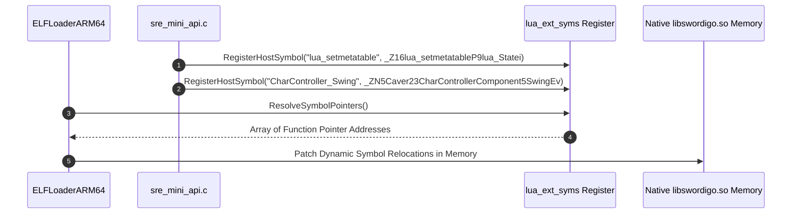

# Caver Desktop SRE Mini API Bridge Documentation

## 1. System Overview & Purpose

The SRE Mini API Bridge (`src/sre/sre_mini_api.c`, `sre_lua_libs.c`, `sre_caver.c`) implements the full SwKiWi and native C++ engine Lua bindings for `SwordigoDesktop` (`swd`).

This document details the symbol resolution mapping tables (`sym_hooks`, `lua_ext_syms`), memory offset translation layers for 64-bit desktop platforms, player recreation deferment queues, and multi-threaded event safety locks.

---

## 2. Namespace & Architecture

```
SwordigoDesktop::MiniAPI
 ├── SRE_MiniAPIBridge (Master Host C Trampoline & Function Resolver)
 ├── SymbolTableMapper (Symbol Name -> Native Function Pointer Address Register)
 ├── MemoryOffsetAdapter (32-bit ARM <-> 64-bit x86 Memory Field Converter)
 └── DeferredActionQueue (Thread-Safe Scene Mutation Queue)
```

---

## 3. Host C Trampoline Symbol Mapping Tables

When loading `libswordigo.so`, `sre_mini_api.c` binds host C functions to native engine calls using dual symbol mapping tables:



---

## 4. 32-bit ARM vs 64-bit x86 Memory Field Offset Adapter

Because mobile ARM (32-bit/64-bit) and desktop x86_64 have different struct padding and pointer sizes ($4\text{ bytes}$ vs $8\text{ bytes}$), `MemoryOffsetAdapter` provides type-safe field accessors:

| Engine Property Field | 32-bit ARM Offset | 64-bit x86_64 Offset | Accessor Function |
| :--- | :--- | :--- | :--- |
| `HeroObject::PlayerLevel` | `+0x5c` | `+0xb8` | `SRE_GetPlayerLevel(heroPtr)` |
| `HeroObject::PlayerExp` | `+0x58` | `+0xb4` | `SRE_GetPlayerExp(heroPtr)` |
| `CharController::WalkSpeed` | `+0x13c` | `+0x278` | `SRE_GetWalkSpeed(ctrlPtr)` |
| `CharController::RunSpeed` | `+0x140` | `+0x280` | `SRE_GetRunSpeed(ctrlPtr)` |
| `CharController::JumpHeight`| `+0x136` | `+0x26c` | `SRE_GetJumpHeight(ctrlPtr)` |
| `ManaComponent::CurrentMana`| `+0x3a` | `+0x74` | `SRE_GetCurrentMana(manaPtr)` |

---

## 5. Deferred Action Queue (`RecreateHero`)

Mod calls like `Mini.RecreateHero()` mutate active scene entities. Executing entity destruction mid-physics tick causes dangling pointer crashes. `SRE_MiniAPIBridge` queues these mutations:

```cpp
void SRE_RecreateHero_Deferred() {
    SRE_QueueDeferredAction([]() {
        auto* scene = GetActiveGameSceneController();
        if (scene) {
            scene->DespawnPlayerHero();
            scene->SpawnPlayerHeroAtLastCheckpoint();
        }
    });
}
```

---

## 6. PC Port (`swd`) Implementation Strategy

1. **Eliminate Offset Hardcoding**: Replace raw hex offset arithmetic (`*(int*)(hero + 0xb8)`) with strongly-typed C++ struct member accessors.
2. **Thread-Safe Event Locking**: Protect `DeferredActionQueue` with `std::mutex` to ensure multi-threaded audio or render threads do not access mutating entity arrays.
