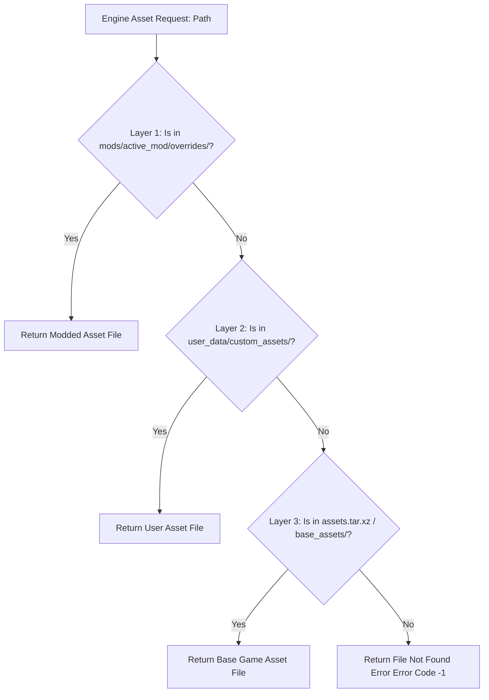

# Caver Desktop Virtual File System (VFS) & Mod Override Architecture

## 1. System Overview & Purpose

The Virtual File System (`src/sre/sre_vfs.c`, `sre_config.c`) in `SwordigoDesktop` provides asset path redirection, mod override priority cascading, PAK archive unpacking, and background asset pre-fetching for desktop PC builds.

This document details VFS resolution priority layers, PAK archive table of contents, configuration parsing (`toml-c`), and file streaming for the C++ PC rewrite.

---

## 2. Namespace & VFS Architecture

```
SwordigoDesktop::VFS
 ├── SRE_VFS (Master Virtual File System Manager)
 ├── AssetPathResolver (Cascading Path Search Engine)
 ├── PAKArchiveReader (Compressed Asset Archive Unpacker)
 └── ConfigParser (TOML / JSON Game Options Reader)
```

---

## 3. Cascading Asset Resolution Priority Pipeline

When the engine requests an asset (e.g. `textures/caver.pvr` or `maps/oakvale.scene`), `AssetPathResolver` searches directories in strict priority order:



---

## 4. PAK Archive & Configuration Schema

### 1. PAK Archive Table of Contents (TOC) Schema
```cpp
namespace SwordigoDesktop {
    struct PAKFileHeader {
        char magic[4];        // "SPAK"
        uint32_t version;     // Format version (e.g. 1)
        uint32_t fileCount;   // Number of archived asset files
        uint64_t tocOffset;   // Byte offset to Table of Contents
    };

    struct PAKEntry {
        char path[128];       // Relative file path (e.g. "scenes/cairnwood.scene")
        uint64_t offset;      // Start byte offset in PAK file
        uint64_t compressedSize;
        uint64_t uncompressedSize;
        uint32_t flags;       // Compression type (0 = Raw, 1 = Zstd / LZ4)
    };
}
```

### 2. Desktop Game Configuration Schema (`sre.toml`)
```toml
[display]
fullscreen = true
resolution_width = 1920
resolution_height = 1080
vsync = true
target_fps = 144

[audio]
master_volume = 1.0
bgm_volume = 0.8
sfx_volume = 0.9

[mods]
enabled = true
load_order = ["hd_textures_v2", "custom_spells_mod", "speedrun_timer"]
```

---

## 5. Reverse Engineering & Tools Integration Notes

- **FileRift Integration**: FileRift assets extracted from mobile APKs are placed directly into Layer 3 (`base_assets/`) for seamless VFS mounting.
- **SwKiWi API Integration**: SwKiWi's `Mini.ReloadTextures()` API call flushes VFS cache tables to dynamically reload updated mod textures without restarting the game client.

---

## 6. PC Port (`swd`) Optimization Strategy

1. **Async Memory-Mapped Files (`mmap`)**: Memory-map active PAK archives directly into 64-bit virtual memory space to achieve zero-copy asset loading.
2. **Hot-Reload File Watcher**: Implement OS file system notification listeners (`inotify` on Linux, `ReadDirectoryChangesW` on Windows) to automatically flush VFS cache when modders modify loose asset files in `mods/`.
