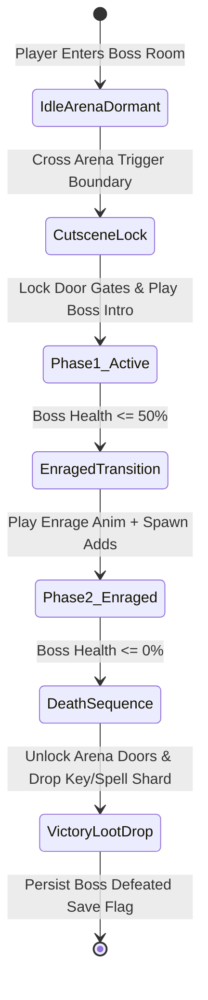

# Caver Boss AI Encounters & Mechanics Documentation

## 1. System Overview & Purpose

Boss encounters in Swordigo feature multi-phase state machines, arena barrier triggers, telegraph animation sequences, invulnerability frames, enraged phase transitions, and victory loot drop sequences.

This document details the AI mechanics, phase logic, attack patterns, arena triggers, and victory sequences for the 4 primary bosses in Swordigo: **Giant Beetle**, **Gargoyle Boss**, **Shadow Hero**, and **Corruptor Lord**.

---

## 2. Boss Class Hierarchy (`Caver::*`)

```
Caver::MonsterEntityComponent
 └── Caver::BossEntityComponent (Base Boss Entity Node)
      ├── Caver::GiantBeetleBossControllerComponent (Boss 1 - Lower Grove Caves)
      ├── Caver::GargoyleBossControllerComponent (Boss 2 - Cairn Wood Caves)
      ├── Caver::ShadowHeroBossControllerComponent (Boss 3 - Great Caves)
      └── Caver::CorruptorLordBossControllerComponent (Final Boss - World Peak)
```

---

## 3. Boss Encounter Master State Machine



---

## 4. Boss Encounters Mechanics Catalog

### 1. Giant Beetle Boss (`GiantBeetleBossControllerComponent`)
- **Location**: Lower Grove Caves.
- **Health**: $250$ HP.
- **Attacks**:
  - **Charge Stampede**: Scuffs ground, flashes red, then sprints across arena floor. Stunned for $2.0\text{s}$ upon colliding with arena wall.
  - **Ground Pound Shockwave**: Leaps vertically into air and slams down, sending ground shockwave particles across floor. Must be dodged by jumping.
- **Enraged Phase ($50\%$ HP)**: Movement speed increases $+35\%$, charge cooldown reduced from $3.0\text{s}$ to $1.2\text{s}$.

### 2. Gargoyle Boss (`GargoyleBossControllerComponent`)
- **Location**: Cairn Wood Caves.
- **Health**: $500$ HP.
- **Attacks**:
  - **Swoop Slash**: Swoops from high ceiling down towards player position.
  - **Fireball Burst**: Takes flight, hovers at arena top center, and fires 3 homing fireballs (`FireBreathComponent`).
- **Enraged Phase ($50\%$ HP)**: Summons 2 Flying Bat adds to distract player while continuously firing fireballs.

### 3. Shadow Hero Boss (`ShadowHeroBossControllerComponent`)
- **Location**: Great Caves.
- **Health**: $1000$ HP.
- **Mechanics**: Mirrors player abilities (uses sword slashes, double jumps, Magic Bolt, and Magic Bomb).
- **Special Attack - Dark Wave**: Charges dark sword energy and unleashes a wide horizontal energy beam. Must be parried with precise sword swing or jumped over.

### 4. Corruptor Lord (`CorruptorLordBossControllerComponent`)
- **Location**: World Peak / Final Realm.
- **Health**: $2500$ HP (3 Distinct Transformation Phases).
- **Phase 1**: Melee & Dark Energy Orbs.
- **Phase 2**: Dimension Shift Mode (Forces player to cast Dimension Rift spell to expose vulnerable core).
- **Phase 3**: Enraged Omnidirectional Bombardment.

---

## 5. Reverse Engineering & Tools Integration Notes

- **Boulder Level Editor**: Boss rooms feature `BossArenaTriggerComponent` linked via `ObjectLinkControllerComponent` to entrance and exit gates.
- **SwKiWi Modding API**: SwKiWi exposes `BossEntityComponent::RegisterCustomBossPhase`, enabling custom multi-phase boss fight mods.

---

## 6. PC Port (`swd`) Implementation Strategy

1. **Dedicated Boss Health Bar UI**: Render dynamic boss health bars at the top center of the screen during active boss encounters.
2. **Phase Transition Camera Shakes**: Trigger camera shake vectors and screen flash shaders during phase transition events to heighten dramatic effect.
