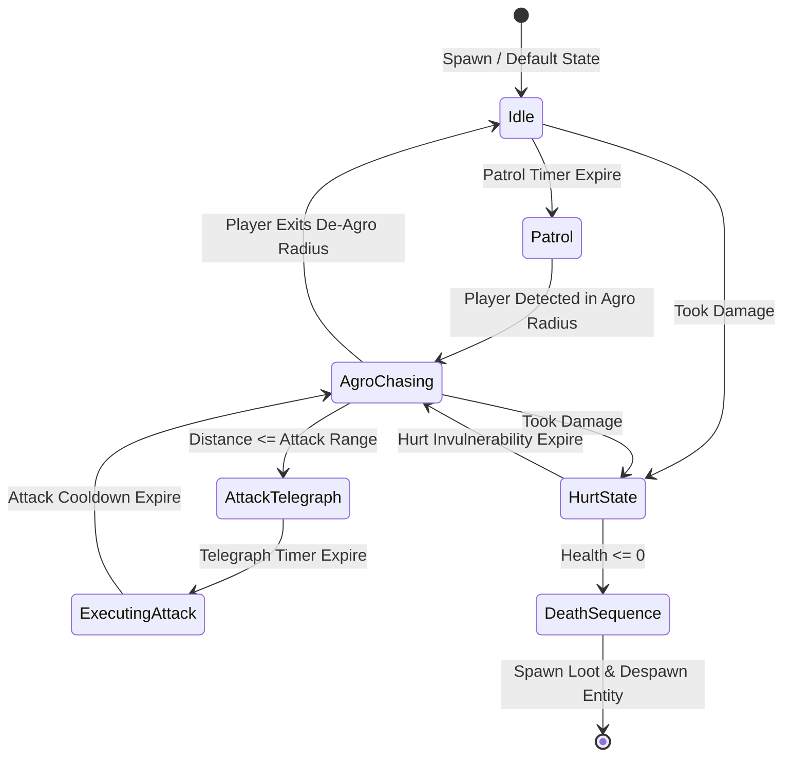

# Caver Enemy AI Behaviors & Controllers Documentation

## 1. System Overview & Purpose

Enemy AI in Swordigo is driven by specialized monster controller components (`MonsterControllerComponent` subclasses) attached to monster entities (`MonsterEntityComponent`).

Each monster type implements a dedicated finite state machine governing agro detection, pathing, patrol routines, attack telegraphing, damage response, and death sequence transitions (`MonsterDeathControllerComponent`).

This document details enemy AI categories, finite state machines, combat behaviors, and loot drops for the C++ PC rewrite.

---

## 2. Namespace & Class Hierarchy (`Caver::*`)

```
Caver::Component
 └── Caver::EntityControllerComponent
      └── Caver::MonsterControllerComponent (Base Monster AI Controller)
           ├── Caver::WalkingMonsterControllerComponent (Patrolling Ground AI - Beetle, Slime)
           ├── Caver::BatMonsterControllerComponent (Swooping Aerial AI - Bat, Flying Fiend)
           ├── Caver::ChargingMonsterControllerComponent (Line-of-Sight Charge AI - Boar, Minotaur)
           ├── Caver::LeapingMonsterControllerComponent (Jumping AI - Spiders, Leaping Fiend)
           ├── Caver::ShootingMonsterControllerComponent (Ranged AI - Mage, Skeleton Archer)
           └── Caver::SkellyMonsterControllerComponent (Shield & Melee AI - Skeleton Warrior)
```

---

## 3. Monster AI Finite State Machine



---

## 4. Monster AI Classes Specifications

### 1. Ground Patrol AI (`WalkingMonsterControllerComponent`)
- **Behaviors**: Walks back and forth between two edge markers (`PatrolBoundLeft`, `PatrolBoundRight`).
- **Edge / Ledge Detection**: Casts a downward diagonal ray in front of feet to detect cliffs. Reverses movement direction before walking off edges.

### 2. Swooping Aerial AI (`BatMonsterControllerComponent`)
- **Behaviors**: Hovers in sinusoidal vertical wave patterns at rest position:
  $$y(t) = y_0 + A \cdot \sin(\omega t)$$
- **Swoop Attack**: When player enters horizontal detection cone, accelerates downwards towards player's last recorded spatial position, then swoops back up.

### 3. Charging Heavy AI (`ChargingMonsterControllerComponent`)
- **Behaviors**: Patrols slowly until player enters line-of-sight corridor.
- **Charge Attack**: Pauses to telegraph (scuffs ground, flashes red), then locks movement vector to max sprint velocity. Cannot change direction mid-charge. On wall collision, triggers stun state ($1.5\text{s}$).

### 4. Skeleton Shield & Sword AI (`SkellyMonsterControllerComponent`)
- **Behaviors**: Advanced combat AI. Raises shield when player swings sword (blocks $100\%$ front physical damage). Waits for player attack recovery frame to execute forward slash.

---

## 5. Reverse Engineering & Tools Integration Notes

- **FileRift Asset Reference**: Enemy 3D mesh models (`.POD`) and animation clip sets (Walk, Idle, Attack, Hurt, Die) parsed via FileRift match monster component class names.
- **SwKiWi API Modding**: SwKiWi exposes `MonsterControllerComponent::RegisterCustomAIController`, enabling custom enemy behaviors and boss mechanics.

---

## 6. PC Port (`swd`) Implementation Strategy

1. **Clean Virtual State Machines**: Replace raw switch-statement state machines in decompiled code with clean polymorph C++ state classes (`IEnemyState`).
2. **Hitbox / Hurtbox Visualizer**: Implement debug rendering for enemy agro radii, attack hitboxes, and cliff detection rays for easy balancing.
