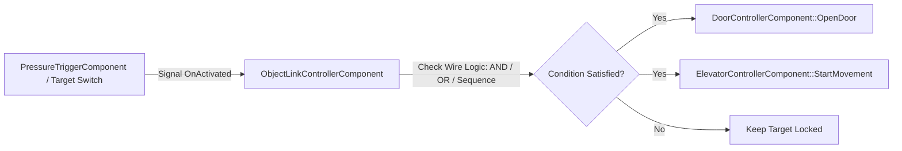

# Caver Interactive World Objects & Components Documentation

## 1. System Overview & Purpose

Interactive world components govern puzzle mechanisms, moving platforms, doors, breakable objects, pressure plates, and object link chains throughout Swordigo's levels.

This document details `DoorControllerComponent`, `ElevatorControllerComponent`, `BushControllerComponent`, `BreakableObjectComponent`, `PressureTriggerComponent`, `OrbitControllerComponent`, and `ObjectLinkControllerComponent`.

---

## 2. Namespace & Class Hierarchy (`Caver::*`)

```
Caver::Component
 ├── Caver::DoorControllerComponent (Key Doors, Boss Doors, Gate Mechanisms)
 ├── Caver::ElevatorControllerComponent (Vertical & Horizontal Moving Platforms)
 ├── Caver::BushControllerComponent (Slashable Vegetation & Item Drop Trigger)
 ├── Caver::BreakableObjectComponent (Destructible Crates, Urns, Bombable Walls)
 ├── Caver::PressureTriggerComponent (Floor Weight Switches & Button Plates)
 ├── Caver::OrbitControllerComponent (Orbital Rotating Platforms & Hazards)
 └── Caver::ObjectLinkControllerComponent (Master Wire Linkage Controller)
```

---

## 3. Object Link Controller System (`ObjectLinkControllerComponent`)

The `ObjectLinkControllerComponent` acts as a logical signal wiring engine connecting puzzle switches (`PressureTriggerComponent`, `TargetSwitchComponent`) to target actuators (`DoorControllerComponent`, `ElevatorControllerComponent`, `SpawnPointComponent`).



### Signal Logic Specifications:
- **AND Gate Wire**: All connected pressure plates must be held down simultaneously to trigger open door signal.
- **OR Gate Wire**: Any single switch trigger sends activation signal.
- **Sequence Wire**: Switches must be activated in exact ordered sequence ($1 \to 2 \to 3$). Wrong sequence resets puzzle.

---

## 4. Interactive Components Specifications

### 1. Locked & Boss Doors (`DoorControllerComponent`)
- **Key Door**: Requires matching key item in player inventory (`item_small_key` or `item_boss_key`). Consumes key on first open, sets persistent save flag (`door_opened_<id>`).
- **Door Animation**: Plays vertical sliding or swing open animation, accompanied by collision shape mask disable (`Mask = 0x0000`).

### 2. Moving Platforms (`ElevatorControllerComponent`)
- **Path Nodes**: Moves along ordered array of 3D waypoint nodes $(\vec{P}_0, \vec{P}_1, \dots, \vec{P}_k)$.
- **Movement Modes**:
  - `PingPong`: Moves back and forth along path continuously.
  - `TriggerActivated`: Stays idle until player stands on platform or activates switch.
  - `OneWay`: Moves to destination node and stops permanently.

### 3. Destructible Vegetation & Crates (`BushControllerComponent` / `BreakableObjectComponent`)
- **Bush Destruction**: On collision with player sword attack hitbox (`Layer 0x0008`), plays leaf shatter particle system (`SparkParticleEmitter`), plays foliage rustle audio, and triggers `ItemDropComponent` roll.
- **Bombable Walls**: Requires Magic Bomb explosion radius to shatter. Replaces solid mesh with fractured mesh fragments (`ShatterComponent`).

---

## 5. Reverse Engineering & Tools Integration Notes

- **Boulder Level Editor Integration**: Boulder provides the visual link wiring tool used to create `ObjectLinkControllerComponent` connections between switches and doors.
- **FileRift Asset Reference**: Fractured shatter models (`.POD`) and door animations parsed via FileRift match object component descriptors.

---

## 6. PC Port (`swd`) Implementation Strategy

1. **Clean Signal / Slot Architecture**: Replace hardcoded entity ID link lookups with standard C++ signal/slot delegates (`sigslot` or `std::function` event listeners).
2. **Deterministic Physics Interpolation**: Ensure elevator moving platforms calculate continuous velocity vectors to prevent player character jitter while riding platforms.
