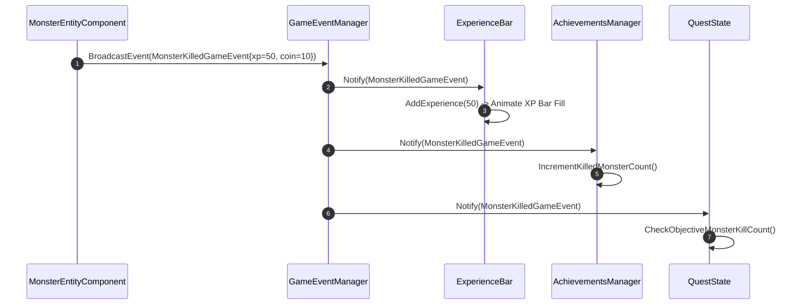

# Caver Global Game Event System Documentation

## 1. System Overview & Purpose

The Game Event System (`Caver::GameEvent`, `Caver::GameEventManager`, `Caver::ExperienceBar`, `Caver::DidEnterPortalGameEvent`) acts as a decoupled message bus across Swordigo. It allows game systems, UI views, entity components, and achievement managers to broadcast and receive event notifications without tight class coupling.

This document details event message types, listener subscription pipelines, event dispatch queues, and UI bar updating logic for the C++ PC rewrite.

---

## 2. Namespace & Event Class Hierarchy (`Caver::*`)

```
Caver::GameEvent (Base Event Notification Class)
 ├── Caver::DidEnterPortalGameEvent (Level Portal Transition Event)
 ├── Caver::PlayerTookDamageGameEvent (Hurt & Invulnerability Event)
 ├── Caver::MonsterKilledGameEvent (Enemy Defeated & XP Award Event)
 ├── Caver::ItemAcquiredGameEvent (Item / Coin Pickup Event)
 └── Caver::QuestStageChangedGameEvent (Quest Advancement Event)

Caver::GameEventManager (Master Event Bus & Listener Register)
Caver::ExperienceBar (Player XP Bar UI Observer View)
```

---

## 3. Decoupled Event Dispatch Pipeline



---

## 4. Master Game Event Catalog

| Event Class Name | Triggering Source | Carried Payload Data | Primary Subscribers |
| :--- | :--- | :--- | :--- |
| `DidEnterPortalGameEvent` | `PortalComponent` | `targetMapID`, `targetPortalID` | `GameViewController`, `GameSceneController` |
| `PlayerTookDamageGameEvent`| `DamageComponent` | `damageAmount`, `attackerEntity` | `HealthBar`, `CharControllerComponent` |
| `MonsterKilledGameEvent` | `MonsterEntityComponent`| `monsterType`, `xpAmount`, `coinAmount` | `ExperienceBar`, `AchievementsManager`, `QuestState` |
| `ItemAcquiredGameEvent` | `CollectableItemComponent`| `itemID`, `quantity` | `InventoryItemPanel`, `ItemOverlay`, `CoinBar` |
| `SpellCastGameEvent` | `SkillComponent` | `spellID`, `manaCost` | `ManaBar`, `ParticleSystem` |

---

## 5. Reverse Engineering & Tools Integration Notes

- **SwKiWi Modding API Integration**: SwKiWi exposes `GameEventManager::SubscribeEvent`, enabling custom mod plugins to listen to any in-game event or post custom user events onto the bus.
- **GlossHook Interception**: Intercepts `GameEventManager::BroadcastEvent` for real-time telemetry logging and speedrun split timing.

---

## 6. PC Port (`swd`) Implementation Strategy

1. **Type-Safe C++ Delegate Bus**: Modernize `GameEventManager` using `std::function` delegates or `std::variant` event structs to eliminate dynamic casting overhead.
2. **Asynchronous Event Queue**: Buffer non-immediate events into a frame queue (`std::vector<GameEvent>`) processed cleanly at the end of each game tick.
