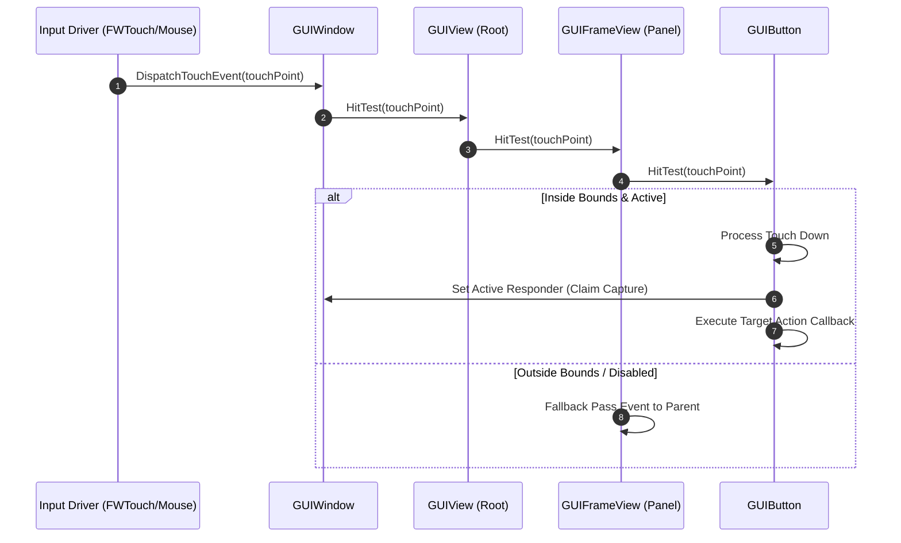

# Caver GUI Core Framework Documentation

## 1. System Overview & Purpose

Swordigo implements a complete custom 2D object-oriented GUI framework. It handles UI hierarchy layout (`GUIWindow`, `GUIView`), touch event responder chain propagation (`GUIResponder`), interactive controls (`GUIButton`, `GUISlider`, `GUISwitch`), auto-layout margins (`GUIViewLayout`, `GUIMargins`), scrollable lists (`GUIScrollView`), and text bubble popups (`GUITextBubble`).

This document details the UI tree architecture, touch event bubble-up chain, rendering passes, and layout computations for the C++ PC rewrite.

---

## 2. Namespace & Class Hierarchy (`Caver::*`)

```
Caver::GUIResponder (Base Event Responder Node)
 └── Caver::GUIView (Base UI View Node & Bounds Node)
      ├── Caver::GUIWindow (Top-Level Root Screen Window Container)
      ├── Caver::GUIControl (Base Interactive Widget)
      │    ├── Caver::GUIButton (Clickable/Touch Button Node)
      │    ├── Caver::GUISlider (Draggable Adjustment Slider)
      │    └── Caver::GUISwitch (Toggle Switch Button)
      ├── Caver::GUILabel (Text Rendering Label Node)
      ├── Caver::GUIFrameView (Bordered Panel View)
      ├── Caver::GUIPopoverView (Modal Dialog Popup View)
      └── Caver::GUIScrollView (Scrollable Content Container)

Caver::GUIViewController (Base Controller for Managing GUI View Trees)
Caver::GUIViewLayout (Layout Manager for Responsive Anchoring & Margins)
```

---

## 3. Responder Chain & Input Event Pipeline

Touch events (`FWTouch`) or keyboard/mouse clicks propagate through the UI view hierarchy using a strict responder chain:



---

## 4. UI Layout, Anchoring & Relative Margins

Swordigo views utilize `Caver::GUIViewLayout` and `Caver::GUIMargins` to maintain resolution independence across mobile aspect ratios ($4:3$, $16:9$, $19.5:9$):

- **Anchor Flags**: `AnchorLeft`, `AnchorRight`, `AnchorTop`, `AnchorBottom`, `CenterHorizontal`, `CenterVertical`.
- **Dynamic Bounds Recalculation**:
  ```cpp
  // Layout recalculation logic
  void GUIView::RecalculateLayout(const Rect& parentBounds) {
      Rect newBounds = m_localRect;
      if (m_layoutFlags & AnchorRight) {
          newBounds.x = parentBounds.width - m_margins.right - m_localRect.width;
      }
      if (m_layoutFlags & CenterHorizontal) {
          newBounds.x = (parentBounds.width - m_localRect.width) * 0.5f;
      }
      m_computedGlobalBounds = newBounds + parentBounds.origin;
      for (auto& child : m_children) {
          child->RecalculateLayout(m_computedGlobalBounds);
      }
  }
  ```

---

## 5. Reverse Engineering & Tools Integration Notes

- **Native SDK Integration**: Interfaced via native platform SDK touch event loops. Touch coordinates are normalized to screen logical dimensions ($960 \times 640$ native design coordinate system).
- **SwKiWi API Integration**: SwKiWi exposes `GUIWindow::AddCustomOverlayView`, allowing mods to render custom health bars, debug stats, or custom UI buttons on top of active HUDs.

---

## 6. PC Port (`swd`) Implementation & Rewrite Guidelines

1. **Mouse / Gamepad Navigation**: Extend `GUIResponder` to support focused widget navigation (D-pad/arrow key focus jumping between buttons) in addition to mouse pointer hover/click events.
2. **Batch Text & Sprite Rendering**: Consolidate individual UI view draw calls into a single batched 2D quad index buffer draw call to maintain high FPS performance.
3. **High-DPI Scaling**: Implement dynamic DPI scaling factors ($1.0\times, 1.5\times, 2.0\times, 4.0\times$) for 4K desktop monitor resolution rendering.
