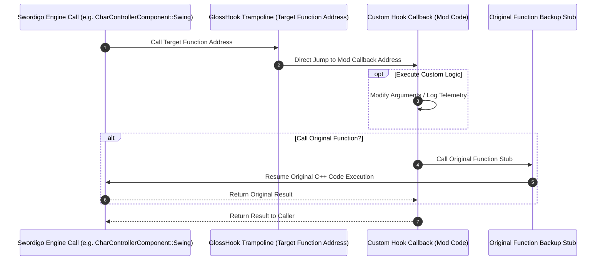

# Caver GlossHook Runtime Hooking & Trampoline Architecture Documentation

## 1. System Overview & Purpose

**GlossHook** is the reverse-engineered ARM64 / x86 dynamic function interception engine for Swordigo (`GlossHook-*`). It enables dynamic function overriding, memory patching, virtual table (VTable) redirection, Global Offset Table (GOT) hooking, and runtime memory inspection without re-compiling the original game executable.

This document details GlossHook's inline trampoline mechanics, memory page permission modifications (`mprotect`), symbol lookup routines, and hook safety guards for the C++ PC port (`swd`).

---

## 2. Namespace & Hooking Architecture

```
GlossHook Runtime Engine
 ├── Symbol Resolver: GlossHook::ResolveSymbol, GlossHook::GetModuleBase
 ├── Inline Hooking: GlossHook::HookFunction, GlossHook::UnhookFunction
 ├── Memory Patching: GlossHook::PatchMemory, GlossHook::WriteNop
 └── Trampoline Mechanics:
      ├── Original Instruction Backup Buffer (16 Bytes ARM64 / 5 Bytes x86)
      ├── Relative / Absolute Jump Instruction Patching
      └── Trampoline Gateway Execution Stub
```

---

## 3. Inline Trampoline Hook Execution Flow



---

## 4. Memory Protection & Instruction Patching

### 1. Memory Permission Modification (`mprotect`)
To overwrite function headers in executable memory segments (`PROT_READ | PROT_EXEC`), GlossHook aligns target addresses to page boundaries and modifies memory permissions:

```cpp
void MakeMemoryWritable(uintptr_t address, size_t size) {
    uintptr_t pageSize = sysconf(_SC_PAGESIZE);
    uintptr_t pageStart = address & ~(pageSize - 1);
    mprotect((void*)pageStart, size + (address - pageStart), PROT_READ | PROT_WRITE | PROT_EXEC);
}
```

### 2. ARM64 Trampoline Jump Patching
On 64-bit ARM architecture, GlossHook overwrites target function entry instructions with an absolute PC-relative branch instruction sequence:

```assembly
LDR X16, #8      ; Load target jump address into register X16
BR X16           ; Branch to register X16
.quad <Mod_Function_Address_64bit>
```

---

## 5. Reverse Engineering & Tools Integration Notes

- **SwKiWi API Integration**: SwKiWi utilizes GlossHook internally to hook native C++ methods (`CharControllerComponent::*`, `PlayerProfile::Save`, `RenderingContext::DrawMesh`) and redirect calls to Lua mod handlers.
- **SRE PC Engine**: Uses GlossHook trampoline concepts to intercept legacy mobile API calls and bridge them to desktop SDL2/OpenGL implementations.

---

## 6. PC Port (`swd`) Implementation Strategy

1. **Native Function Pointer Overrides**: Replace runtime dynamic assembly hooking in the PC port rewrite with clean C++ virtual methods or function pointer delegates (`std::function`).
2. **Built-in Modding Hooks**: Provide clean pre/post hook delegates (`OnBeforePlayerSwing`, `OnAfterPlayerSwing`) in `swd` to allow mods without binary memory patching.
