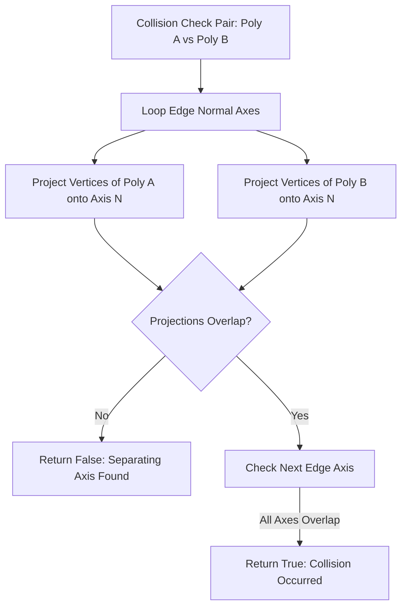

# Caver Vector, Matrix & Geometric Math Engine Documentation

## 1. System Overview & Purpose

The decompiled source in `GhidraDecomp src/misc/` details Swordigo's custom linear algebra and 2D/3D geometry engine (`Vector2`, `Vector3`, `Vector4`, `Matrix4`, `Quaternion`, `Polygon`, `Circle`, `Rectangle`, `OrientedRect`, `Box`, `BezierSegment`, `C_Matrix4Mul`).

This document details 3D transformation matrices, quaternion rotations, spatial geometry intersection algorithms (Separating Axis Theorem / SAT), and SIMD-optimized matrix multiplication routines for the C++ PC rewrite.

---

## 2. Namespace & Math Class Hierarchy (`Caver::*`)

```
Caver::Math
 ├── Vectors: Vector2, Vector3, Vector4
 ├── Matrices: Matrix4 (4x4 Column-Major Transformation Matrix)
 ├── Rotations: Quaternion (4D Unit Rotation Quaternion)
 └── Primitives:
      ├── Circle (2D Radial Bounding Bound)
      ├── Rectangle (2D Axis-Aligned Bounding Box - AABB)
      ├── OrientedRect (2D Oriented Bounding Box - OBB)
      ├── Polygon (Arbitrary 2D Convex / Concave Polygon)
      ├── Box (3D Axis-Aligned Bounding Box - AABB)
      └── BezierSegment (Cubic Bezier Curve Interpolator)
```

---

## 3. Matrix Transformations & SIMD Multiplication

### 1. 4x4 Matrix Column-Major Layout (`Matrix4`)
$$M = \begin{bmatrix} m_{00} & m_{10} & m_{20} & m_{30} \\ m_{01} & m_{11} & m_{21} & m_{31} \\ m_{02} & m_{12} & m_{22} & m_{32} \\ m_{03} & m_{13} & m_{23} & m_{33} \end{bmatrix}$$

### 2. SIMD Vector Batch Multiplication (`C_Matrix4Vector3ArrayMul`)
For high-performance vertex batch transformation, `C_Matrix4Vector3ArrayMul` multiplies a contiguous array of 3D position vectors $\vec{v}_i = (x_i, y_i, z_i)$ by transformation matrix $M$:
$$\vec{v}'_i = M \cdot \begin{bmatrix} x_i \\ y_i \\ z_i \\ 1.0 \end{bmatrix}$$
On ARM NEON / x86 SSE2 CPU architecture, 4 vector coordinates are processed simultaneously per SIMD register instruction cycle.

---

## 4. Geometric Intersection Algorithms

### 1. Separating Axis Theorem (SAT) for Polygons & OBBs
To check if two convex polygons $P_A$ and $P_B$ intersect:
1. For each edge vector $\vec{e}$ in $P_A$ and $P_B$, compute normal axis $\vec{N} = \text{Perpendicular}(\vec{e})$.
2. Project all vertices of $P_A$ and $P_B$ onto axis $\vec{N}$:
   $$I_A = [\min(\vec{v}_A \cdot \vec{N}), \max(\vec{v}_A \cdot \vec{N})], \quad I_B = [\min(\vec{v}_B \cdot \vec{N}), \max(\vec{v}_B \cdot \vec{N})]$$
3. If $I_A \cap I_B = \emptyset$ on any projection axis $\vec{N}$, the shapes **do not intersect** (Separating Axis Found).



### 2. Cubic Bezier Curve Evaluation (`BezierSegment`)
Used for smooth camera spline paths and hookshot cable rendering:
$$\mathbf{B}(t) = (1-t)^3 \mathbf{P}_0 + 3(1-t)^2 t \mathbf{P}_1 + 3(1-t) t^2 \mathbf{P}_2 + t^3 \mathbf{P}_3, \quad t \in [0, 1]$$

---

## 5. Reverse Engineering & Tools Integration Notes

- **FileRift Extractor**: FileRift utilizes `Matrix4` and `Quaternion` routines to transpose POD model bone animations into world space coordinates.
- **Boulder Map Editor**: Boulder relies on `Polygon` and `OrientedRect` math structures for terrain polyline editing and collision box manipulation.

---

## 6. PC Port (`swd`) Implementation Strategy

1. **Standardize to GLM (OpenGL Mathematics)**: Replace legacy custom math types directly with **GLM** (`glm::vec2`, `glm::vec3`, `glm::quat`, `glm::mat4`) for full alignment with modern graphics standards.
2. **x86 SSE2 / AVX2 Acceleration**: Compile GLM SIMD intrinsics (`GLM_FORCE_INTRINSICS`) to leverage desktop CPU SIMD registers for ultra-fast matrix transformations.
