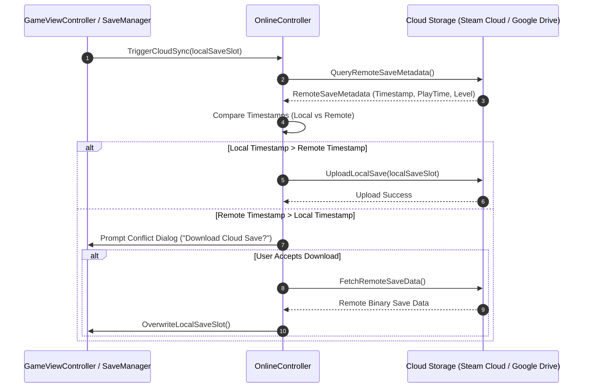

# Caver Online Services & Cloud Sync Documentation

## 1. System Overview & Purpose

The online services subsystem (`Caver::OnlineController`, `Caver::OnlineController_Android`, `Caver::OnlineMenuView`, `Caver::OnlineMenuViewController`) manages cloud save synchronization, leaderboards, player stats uploads, achievement cross-platform syncing, and platform network account authentication.

This document details online controller workflows, cloud save conflict resolution, leaderboard data structures, and platform abstraction for the C++ PC rewrite.

---

## 2. Namespace & Class Hierarchy (`Caver::*`)

```
Caver::OnlineController (Master Cloud & Social Services Abstraction)
 ├── Caver::OnlineController_Android (Google Play Games & Cloud Save Implementation)
 ├── Caver::OnlineMenuView (Online Menu GUI View Screen)
 └── Caver::OnlineMenuViewController (Online Service UI Controller)
```

---

## 3. Cloud Save Synchronization & Conflict Resolution Workflow



---

## 4. Leaderboard & Player Stats Upload

### Leaderboard Data Schema Structure
```cpp
namespace Caver {
    struct LeaderboardEntry {
        std::string playerDisplayName;
        int rankPosition;
        uint32_t speedrunTimeMs;  // Speedrun completion time in milliseconds
        int playerLevel;
        uint64_t scoreTimestamp;
    };

    class OnlineController {
    public:
        virtual void UploadSpeedrunScore(uint32_t completionTimeMs) = 0;
        virtual void FetchTopLeaderboardEntries(int count, std::function<void(const std::vector<LeaderboardEntry>&)> callback) = 0;
    };
}
```

---

## 5. Reverse Engineering & Tools Integration Notes

- **Native SDK Reference**: Platform NDK wrappers for Google Play Games / Apple Game Center services.
- **SwKiWi Modding API**: SwKiWi exposes `OnlineController::RegisterCustomLeaderboard`, enabling custom speedrun category leaderboards (e.g. 100% All Chests, Glitchless Any%).

---

## 6. PC Port (`swd`) Implementation Strategy

1. **Steamworks SDK Integration**: Implement `OnlineController_Steam` utilizing `SteamUserStats()` for achievements and `SteamRemoteStorage()` for seamless Steam Cloud sync.
2. **Offline Fallback Queue**: Cache achievement unlocks and leaderboard uploads locally in an encrypted queue when offline, syncing automatically upon network restoration.
