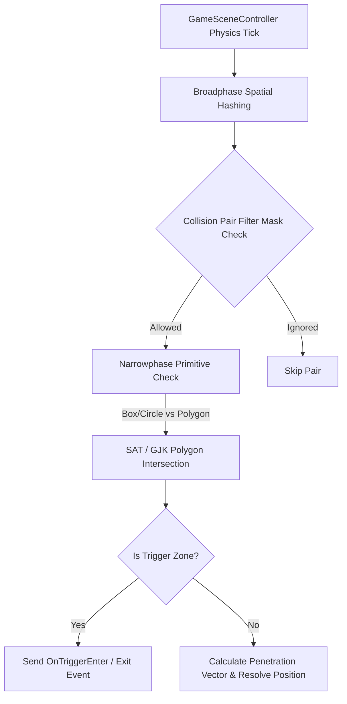

# Caver Spatial Collision & Trigger Hierarchy Documentation

## 1. System Overview & Purpose

Swordigo uses a 2.5D spatial collision engine built on polygon ground bounds (`GroundPolygonComponent`), box/circle primitive collision shapes (`CollisionShapeComponent`, `ShapeComponent`), bone-controlled mesh colliders (`BoneControlledCollisionShapeComponent`), and collision pair filtering (`CollisionPairSet`).

This document details the collision detection pipelines, layer bitmasks, trigger zones, and spatial query mechanisms for the C++ PC rewrite.

---

## 2. Namespace & Class Hierarchy (`Caver::*`)

```
Caver::Component
 ├── Caver::ShapeComponent (Base Collider Primitive)
 │    ├── Caver::CollisionShapeComponent (Rigid Collider & Trigger Zone)
 │    ├── Caver::UtilityShapeComponent (Sensor & Raycast Volume)
 │    └── Caver::BoneControlledCollisionShapeComponent (Animated Character Collider)
 └── Caver::GroundPolygonComponent (Terrain Static Collision Surface)

Caver::CollisionPairSet (Collision Filter Bitmask & Pair Cache)
```

---

## 3. Collision Layers & Filter Matrix

Swordigo categorizes scene entities and static geometry into distinct collision layers to maximize spatial query performance:

| Bit Mask | Layer Name | Description | Collides With |
| :--- | :--- | :--- | :--- |
| `0x0001` | **World Static** | Ground polygons, static walls, ceilings. | Player, Enemies, Projectiles, Items, Physics Objects |
| `0x0002` | **Player** | Hero entity hitbox and hurtbox. | World Static, Enemies, Enemy Projectiles, Triggers, Items |
| `0x0004` | **Enemy** | Monster entity hitboxes. | World Static, Player, Player Weapons/Spells, Physics Objects |
| `0x0008` | **Player Attack** | Sword slash arc, magic bolts, bomb explosion radius. | Enemy, Breakable Objects, Switches |
| `0x0010` | **Enemy Attack** | Monster attack hitboxes, monster projectiles. | Player |
| `0x0020` | **Trigger / Portal**| Scene transition zones, checkpoint areas, pressure plates. | Player |
| `0x0040` | **Collectable Item**| Coins, health hearts, mana drops, key items. | Player, World Static (for ground resting) |
| `0x0080` | **Physics Dynamic**| Pushable crates, rolling boulders, elevators. | World Static, Player, Enemy, Physics Dynamic |

---

## 4. Collision Resolution & Spatial Query Pipeline



### Static Ground Polygon Query (`GroundPolygonComponent`)
Terrain surfaces are defined as continuous 2D polyline segments with normal vectors $\vec{N} = (N_x, N_y)$. Ground detection raycasts fire vertically downwards from entity feet bounds.
- If ray distance $d \le \text{ground\_threshold}$ and $\vec{N}_y > \cos(\theta_{\text{max}})$, entity is flagged as `Grounded`.

---

## 5. Reverse Engineering & Tools Integration Notes

- **Boulder Map Editor**: Boulder parses and exports `GroundPolygonComponent` polylines directly from SVG/binary scene paths.
- **FileRift Asset Export**: FileRift converts 3D POD mesh bounding boxes into `CollisionShapeComponent` primitives for PC port asset extraction.

---

## 6. PC Port (`swd`) Implementation Strategy

1. **Adopt Box2D / Custom Spatial Grid**: Map Swordigo's layer mask hierarchy into a clean 2D Box2D world or custom spatial hash grid.
2. **Deterministic Trigger Callbacks**: Ensure trigger entry (`OnTriggerEnter`) and exit (`OnTriggerExit`) maintain strict ordering across frames to prevent portal transition sequence deadlocks.
