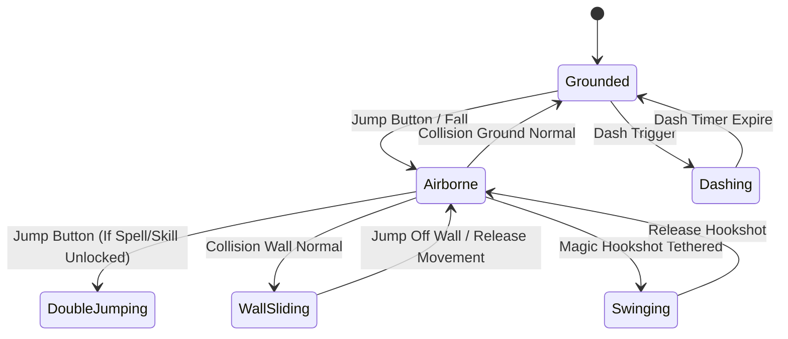

# Caver Player Physics & Character Controller Documentation

## 1. System Overview & Purpose

The character physics controller (`Caver::CharControllerComponent`) governs player movement, jump mechanics, gravity application, slope handling, wall contact, platform velocity inheritance, double jump triggers, dash mechanics, and hurtbox/hitbox response.

It coordinates closely with `Caver::PhysicsObjectComponent`, `Caver::CharacterState`, and `Caver::HeroEntityComponent`.

---

## 2. Namespace & Class Structure

```
Caver::Component
 └── Caver::CharControllerComponent
      ├── Caver::PhysicsObjectComponent (Physics Body Dynamics)
      ├── Caver::CharacterState (Grounded, Airborne, WallSliding, Swinging, Dead)
      └── Caver::HeroEntityComponent (Player Equipment & Power-ups Modifier)
```

---

## 3. Physics Simulation & Controller State Machine

### Player State Machine (`Caver::CharacterState`)


### Movement Logic & Constants Specifications
1. **Horizontal Acceleration**:
   - Ground Acceleration: Smooth linear interpolation towards target velocity based on analog/D-pad input.
   - Airborne Acceleration: Reduced air control factor ($0.65\times$ ground acceleration) to preserve jump momentum.
   - Slope Compensation: Raycasts evaluate slope angle $\theta$. If $\theta \le \theta_{\text{max\_climb}}$, vertical velocity compensates to maintain horizontal speed without sliding.
2. **Jump Dynamics**:
   - Variable Jump Height: Holding the jump button sustains initial upward velocity vector for $N$ frames.
   - Coyote Time: Allows jump initiation within $0.15\text{s}$ window after walking off platform edges.
   - Jump Buffer: Caches jump input up to $0.12\text{s}$ prior to touching ground.
3. **Platform Velocity Transfer**:
   - When standing on moving platforms (`Caver::ElevatorControllerComponent` / `PhysicsPlatformComponent`), the player inherits the platform's velocity vector $\vec{V}_{\text{platform}}$. Upon jumping, $\vec{V}_{\text{platform}}$ is added to the jump impulse.

---

## 4. Reverse Engineering & Tools Integration

- **GlossHook Integration**: Modding hooks intercept `CharControllerComponent::ApplyImpulse` to customize player movement velocity, god mode, and unlimited double jumps.
- **Native SDK Reference**: Platform input from touch controls (virtual joystick / buttons) or physical gamepads is converted into normalized directional vectors before calling `SetMovementVector(vec2)`.

---

## 5. C++ PC Rewrite (`swd`) Implementation Specs

```cpp
namespace Caver {
    struct CharacterPhysicsConfig {
        float moveSpeed = 8.5f;
        float airControlFactor = 0.65f;
        float jumpImpulse = 14.0f;
        float doubleJumpImpulse = 12.5f;
        float gravityScale = 2.8f;
        float maxSlopeAngle = 45.0f;
        float coyoteTimeDuration = 0.15f;
        float jumpBufferDuration = 0.12f;
    };

    class CharControllerComponent : public Component {
    public:
        void OnUpdate(float deltaTime) override;
        void OnFixedUpdate(float fixedDeltaTime);
        void SetInputVector(const glm::vec2& input);
        void TriggerJump();
        void TriggerDash();
        bool IsGrounded() const;
    };
}
```
- **Precision Raycasting**: Utilize Box2D or Chipmunk2D shape queries to cast downward rays from character base bounds to accurately detect ground normal vectors.
- **Interpolated Rendering**: Decouple character rendering transform from physics tick state by storing previous and current tick transforms for smooth $60\text{Hz} \to 240\text{Hz}$ screen rendering interpolation.
