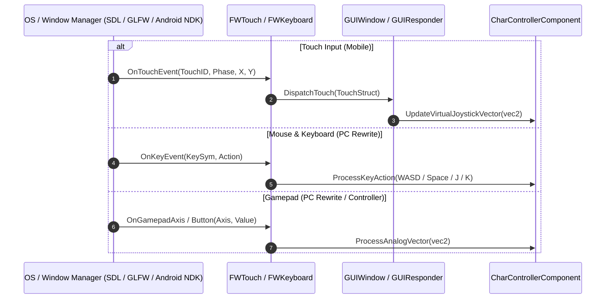

# Caver Platform Abstraction & Input Engine Documentation

## 1. System Overview & Purpose

The Platform Abstraction and Input Engine (`FWTouch`, `FWKeyboard`, `OnlineController_Android`, `StoreController_Android`) bridges operating system input drivers, touch screen events, keyboard/gamepad inputs, and platform service callbacks into Swordigo's game engine.

This document details input event handling, key mapping systems, touch gesture conversion, and platform SDK wrappers for the C++ PC rewrite.

---

## 2. Namespace & Class Hierarchy (`Caver::*`)

```
FWTouch (Platform Touch Event Struct & Driver Interface)
FWKeyboard (Platform Keyboard / Gamepad Driver Interface)

Caver::
 ├── PlatformController (Base OS Event & Window Driver)
 ├── OnlineController (Platform Cloud & Social Services Abstraction)
 │    └── OnlineController_Android (Android Google Play Services Implementation)
 └── StoreController (Platform Store Billing Abstraction)
      └── StoreController_Android (Android In-App Billing Implementation)
```

---

## 3. Input Handling Pipeline



---

## 4. Input Mapping Specifications for PC Rewrite (`swd`)

### Desktop Input Action Bindings

| Action Name | Keyboard Key Bind | Gamepad Button Bind | Game Engine Trigger |
| :--- | :--- | :--- | :--- |
| **Move Left** | `A` / Left Arrow | Left Stick / D-Pad Left | `CharControllerComponent::SetInputVector(-1, 0)` |
| **Move Right** | `D` / Right Arrow | Left Stick / D-Pad Right | `CharControllerComponent::SetInputVector(+1, 0)` |
| **Jump** | `Space` / `K` | `Button A` (South) | `CharControllerComponent::TriggerJump()` |
| **Attack (Sword)** | `J` / Left Click | `Button X` (West) | `HeroEntityComponent::TriggerAttack()` |
| **Cast Spell** | `L` / Right Click | `Button B` (East) | `SkillComponent::CastActiveSpell()` |
| **Dimension Rift** | `Shift` / `E` | `Right Bumper (RB)` | `SkillComponent::CastDimensionRift()` |
| **Pause Menu** | `Escape` / `P` | `Start Button` | `GameViewController::PauseGame()` |
| **Spell Quick-Select**| `1`, `2`, `3`, `4` | `D-Pad Up / Down` | `SkillPickerView::SelectSkill(index)` |

---

## 5. Reverse Engineering & Tools Integration Notes

- **Native SDK Reference**: The decompiled `Native_SDK-master` directory provides the original iOS/Android wrapper layer. In `swd`, these wrappers are replaced with SDL2/GLFW windowing.
- **SwKiWi API Modding**: SwKiWi exposes `InputManager::RegisterCustomKeybind`, enabling player custom key rebinding.

---

## 6. PC Port (`swd`) Implementation Strategy

1. **SDL2 Window & Input Driver**: Utilize SDL2 (`SDL_Init(SDL_INIT_GAMECONTROLLER)`) for robust cross-platform window management, hot-pluggable controller support, and high-frequency mouse polling.
2. **Rebindable Key Configuration**: Store custom player key bindings in standard user configuration files (`config.ini` or `input_bindings.json`).
