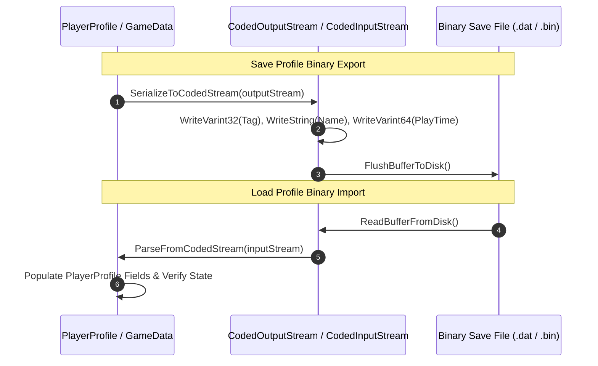

# Caver Protobuf Serialization & Network Message Protocol Documentation

## 1. System Overview & Purpose

The decompiled source in `GhidraDecomp src/protobuf` demonstrates that Swordigo utilizes Google Protocol Buffers (`MessageLite`, `CodedInputStream`, `CodedOutputStream`, `WireFormatLite`) for binary serialization of game options, player profiles, level state descriptors, component state snapshots, and online network packets.

This document details protobuf message definitions, binary stream encoding/decoding, field tag wire types, and state serialization routines for the C++ PC rewrite.

---

## 2. Namespace & Message Class Hierarchy (`Caver::Proto::*`)

```
google::protobuf::MessageLite (Base Protobuf Message Interface)
 ├── Caver::Proto::Program (Master Program Configuration Message)
 ├── Caver::Proto::PlayerProfile (Serialized User Profile Save File Message)
 ├── Caver::Proto::GameData (Persistent Game Flags & Stats Message)
 ├── Caver::Proto::GameState (Active Game Scene State Snapshot)
 ├── Caver::Proto::LevelState (Map Node State & Discovered Trigger Message)
 ├── Caver::Proto::Scene (Scene File Node Tree Message)
 ├── Caver::Proto::Map (World Map Node Registry Message)
 └── Caver::Proto::Quest (Quest Progress State Message)
```

---

## 3. Protobuf Wire Format & Tag Specification

Protobuf packs key-value pairs into compact varint-encoded stream tags:

$$\text{Tag} = (\text{Field Number} \ll 3) \mid \text{Wire Type}$$

### Supported Wire Types Matrix:

| Wire Type ID | Type Name | Meaning & Usage | Used In Swordigo For |
| :--- | :--- | :--- | :--- |
| `0` | **Varint** | Variable length 1-8 byte integer. | Player XP, coins, quest flags, level indices. |
| `1` | **64-bit** | Fixed 8 bytes. | Double precision floats, timestamp counters. |
| `2` | **Length-delimited**| Varint length + byte payload. | Strings (map names), sub-messages, repeated fields. |
| `5` | **32-bit** | Fixed 4 bytes. | Single precision floats (entity position $x, y, z$). |

---

## 4. Binary Read & Write Flow



---

## 5. Reverse Engineering & Tools Integration Notes

- **FileRift Asset Reference**: FileRift contains protobuf descriptor parsers capable of decoding binary `.bin` level states into editable JSON objects.
- **SwKiWi API Modding**: SwKiWi exposes `ProtoSerializer::DecodeMessage` and `EncodeMessage`, allowing mods to inspect and modify binary save payloads programmatically.

---

## 6. PC Port (`swd`) Implementation Strategy

1. **Modern Protobuf / FlatBuffers Migration**: Regenerate C++ headers using standard Google Protobuf compiler (`protoc`) or upgrade to FlatBuffers for zero-copy binary serialization performance.
2. **Schema Backward Compatibility**: Preserve original field tag IDs (e.g. `tag_player_coins = 3`, `tag_quest_flags = 7`) to ensure $100\%$ backward save compatibility with original mobile save files.
