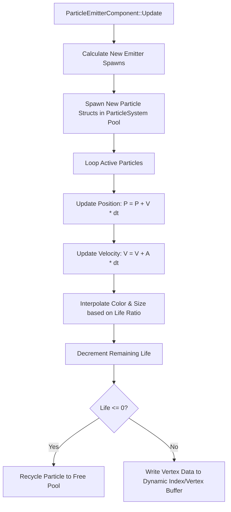

# Caver Particle Engine Documentation

## 1. System Overview & Purpose

The particle engine in Swordigo manages visual particle effects, magic spell trails, sword slashes, item drop glows, dust puffs, and explosion debris (`Caver::ParticleSystem`, `Caver::ParticleEmitterComponent`).

This document details particle life cycles, emission parameters, velocity dynamics, and specialized emitter types for the C++ PC rewrite.

---

## 2. Namespace & Class Hierarchy (`Caver::*`)

```
Caver::Component
 ├── Caver::ParticleComponent (Base Particle Emitter Component)
 └── Caver::ParticleEmitterComponent (Master Particle Generator)
      ├── Caver::FountainParticleEmitter (Continuous Upward Fountain - Magic Spells)
      ├── Caver::SparkParticleEmitter (Short Burst Emitter - Slash Sparks, Bush Leaf Shatter)
      ├── Caver::WhooshParticleEmitter (Sword Arc Motion Trail Emitter)
      ├── Caver::TrailParticleEmitter (Magic Bolt & Hookshot Projectile Trails)
      └── Caver::BlastParticleEmitter (Omnidirectional Explosion Debris)

Caver::ParticleSystem (Master Particle Buffer Manager & Particle Array Container)
```

---

## 3. Particle Data Structure & Simulation Logic

Each individual particle instance in `ParticleSystem` is represented by a lightweight pod structure:

```cpp
namespace Caver {
    struct Particle {
        glm::vec3 position;
        glm::vec3 velocity;
        glm::vec3 acceleration;
        glm::vec4 colorStart;
        glm::vec4 colorEnd;
        float sizeStart;
        float sizeEnd;
        float rotation;
        float angularVelocity;
        float lifeSpan;       // Total lifetime in seconds
        float remainingLife;  // Countdown timer
    };

    struct EmitterConfig {
        int maxParticles = 256;
        float emissionRate = 50.0f; // Particles per second
        float lifeSpanMin = 0.5f;
        float lifeSpanMax = 1.2f;
        glm::vec3 velocityMin;
        glm::vec3 velocityMax;
        glm::vec3 gravityForce = glm::vec3(0.0f, -9.81f, 0.0f);
        BlendMode blendMode = BlendMode::Additive;
        std::string textureName;
    };
}
```

---

## 4. Particle Update & Simulation Pipeline



---

## 5. Reverse Engineering & Tools Integration Notes

- **FileRift Asset Reference**: Particle texture atlases (e.g. `spark.pvr`, `smoke.pvr`, `glow.pvr`) converted via FileRift match particle configuration names in `ParticleEmitterComponent`.
- **SwKiWi API Modding**: SwKiWi exposes `ParticleSystem::SpawnParticleEffect`, allowing custom spell mods to spawn custom particle bursts.

---

## 6. PC Port (`swd`) Implementation Strategy

1. **GPU Compute / Instanced Quad Rendering**: Upgrade particle vertex updates from CPU array writes to instanced GPU draw calls (`glDrawArraysInstanced`) or GPU compute shaders.
2. **High Frame-Rate Smoothing**: Ensure particle velocity integration uses delta-time scaling to maintain identical particle trajectories at $60\text{Hz}$, $144\text{Hz}$, and $240\text{Hz}$.
