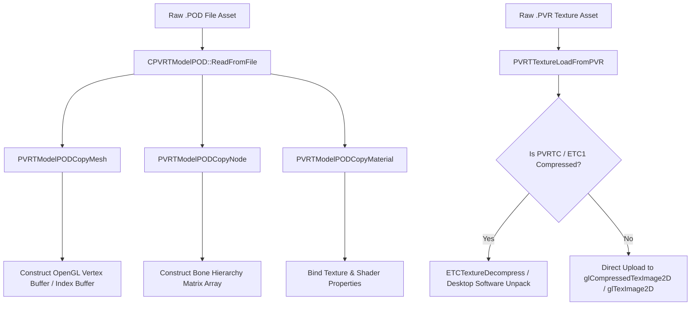

# Caver PVR Texture & POD Model Formats Documentation

## 1. System Overview & Purpose

Swordigo uses Imagination Technologies PowerVR file formats for 3D meshes and textures: `.POD` (PowerVR Object Data) for 3D character models and level props, and `.PVR` (PowerVR Texture) for compressed textures (PVRTC / ETC1).

This document details binary loading pipelines (`CPVRTModelPOD`, `PODLoader`), texture decompression (`ETCTextureDecompress`, `PVRTTextureLoadFromPVR`), model matrix hierarchies, and integration with **FileRift**.

---

## 2. Namespace & Loader Class Hierarchy (`Caver::*`)

```
CPVRTModelPOD (Imagination PowerVR POD Model Data Container)
 ├── Caver::PODLoader (Level & Entity 3D Model Loading Engine)
 ├── Caver::PVRTModelPODCopyMesh (Mesh Geometry Extraction)
 ├── Caver::PVRTModelPODCopyMaterial (Material & Shader Attribute Parsing)
 └── Caver::PVRTModelPODFlattenToWorldSpace (Bone Matrix Hierarchy Transposer)

PVR Texture Utilities:
 ├── Caver::PVRTTextureLoadFromPVR (PVR Container Header Parser)
 ├── Caver::ETCTextureDecompress (ETC1 / PVRTC Compressed Texture Unpacker)
 └── Caver::PVRTTextureDeTwiddle (Morton Order Twizzled Texture De-interleaver)
```

---

## 3. POD Model & PVR Texture Binary Pipeline



---

## 4. File Format Specifications

### 1. POD Model Node Matrix Structure
Each POD file contains a scene node tree (`SPODNode`). Node transforms combine translation $\vec{T}$, rotation quaternion $\vec{Q}$, and scale $\vec{S}$:
$$M_{\text{local}} = M_{\text{translate}}(\vec{T}) \cdot M_{\text{rotate}}(\vec{Q}) \cdot M_{\text{scale}}(\vec{S})$$
`PVRTModelPODFlattenToWorldSpace` evaluates world matrices recursively down the node tree:
$$M_{\text{world\_child}} = M_{\text{world\_parent}} \cdot M_{\text{local\_child}}$$

### 2. Texture Decompression Formats (PVRTC / ETC1)
- **ETC1 (Ericsson Texture Compression)**: $4\times 4$ pixel blocks compressed into 64-bit descriptors.
- **PVRTC (PowerVR Texture Compression)**: 2bpp and 4bpp compressed texture formats.
- **FileRift Converter Role**: FileRift decompresses PVRTC/ETC1 mobile textures into standard desktop RGBA PNG files for PC port rendering.

---

## 5. Reverse Engineering & Tools Integration Notes

- **FileRift Converter Integration**: FileRift directly implements `CPVRTModelPOD` binary parsing to export Swordigo's character models (`caver.pod`, `beetle.pod`, `gargoyle.pod`) into glTF 2.0 / OBJ formats.
- **Boulder Editor Reference**: Boulder uses `PODLoader` to preview 3D static level mesh models in its map editing viewport.

---

## 6. PC Port (`swd`) Implementation Strategy

1. **Convert to glTF 2.0 Format**: Migrate game asset pipelines from proprietary binary `.POD` files to standard modern `glTF 2.0` (`.gltf`/`.glb`) formats for easy editing and rendering.
2. **Convert Textures to PNG / DDS**: Convert all compressed `.PVR` textures into uncompressed `.PNG` or desktop-native `.DDS` (BC1/BC3/BC7) texture formats.
