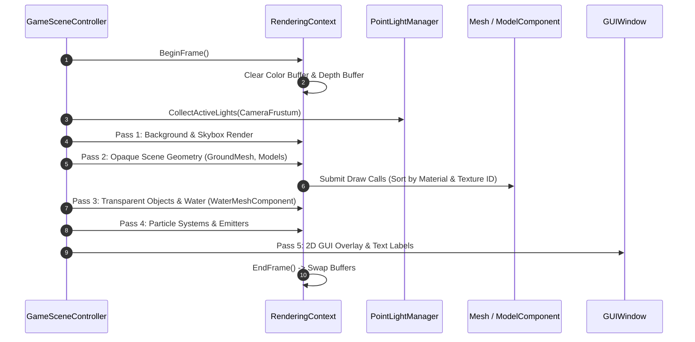

# Caver Rendering Pipeline & Shader Engine Documentation

## 1. System Overview & Purpose

The rendering pipeline in Swordigo manages OpenGL ES 2.0 graphics state (`Caver::RenderingContext`), mesh batching (`Caver::Mesh`, `Caver::MeshBuilder`), dynamic light mapping (`Caver::LightComponent`, `Caver::PointLightManager`), ground terrain meshes (`Caver::GroundMeshComponent`), and texture management (`Caver::TextureLibrary`).

This document details the rendering passes, shader programs, mesh batching strategies, and dynamic lighting pipelines for the C++ PC rewrite.

---

## 2. Namespace & Class Hierarchy (`Caver::*`)

```
Caver::RenderingContext (Master OpenGL State & Shader Program Manager)
 ├── Caver::Mesh (Base Mesh Geometry Buffer - Index & Vertex Buffers)
 ├── Caver::MeshBuilder (Procedural Geometry Generator & Dynamic Batcher)
 ├── Caver::TextureLibrary (Texture Allocation & Atlas Subtexture Register)
 ├── Caver::ModelComponent (Entity 3D Mesh Component Link)
 ├── Caver::GroundMeshComponent (Terrain 2.5D Polytree Mesh Renderer)
 ├── Caver::LightComponent (Dynamic Point Light & Directional Light Node)
 └── Caver::PointLightManager (Global Light Accumulation Array Manager)
```

---

## 3. Render Pass Execution Flow



---

## 4. Lighting & Shader Engine Specifications

### 1. Point Light Attenuation Formula (`PointLightManager`)
Swordigo computes dynamic lighting per vertex / fragment using distance attenuation:
$$I_{\text{light}} = \frac{I_0}{1.0 + k_1 \cdot d + k_2 \cdot d^2} \cdot \max(0.0, \vec{N} \cdot \vec{L})$$
Where $d = \|\vec{P}_{\text{vertex}} - \vec{P}_{\text{light}}\|$, $I_0$ is light color intensity, and $k_1, k_2$ are attenuation constants.

### 2. Shader Program Registry
- **`BasicRenderingProgram`**: Unlit and vertex-lit texturing for basic models and UI quads.
- **`GroundMeshShader`**: Multi-textured terrain mesh shader blending grass, rock, and dirt layers using vertex color masks.
- **`ParticleShader`**: Additive and alpha-blended particle rendering shader.
- **`DimensionRippleProgram`**: Screen-space post-processing distortion shader used during Dimension Rift spell mode.

---

## 5. Reverse Engineering & Tools Integration Notes

- **FileRift Asset Reference**: FileRift converts raw PVR texture assets and POD model meshes into desktop-compatible PNG textures and OBJ/GLTF models.
- **SwKiWi API Modding**: SwKiWi exposes `RenderingContext::RegisterCustomShader`, allowing modders to inject custom shaders (e.g. bloom, water reflections, dynamic shadows).

---

## 6. PC Port (`swd`) Implementation Strategy

1. **Modern Vulkan / OpenGL 4.5 Driver**: Replace mobile OpenGL ES 2.0 calls with modern OpenGL 4.5 or Vulkan API draw pipelines.
2. **Instanced Rendering**: Upgrade individual `ModelComponent` draw calls to use instanced drawing (`glDrawElementsInstanced`) for repeated props (trees, rocks, coins).
3. **Flexible Resolution & Aspect Ratio Support**: Implement dynamic projection matrix calculation supporting $16:9$, $16:10$, $21:9$, and $32:9$ ultrawide display monitors.
