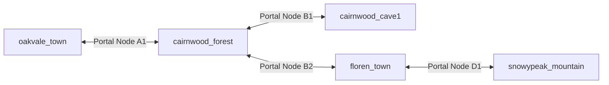
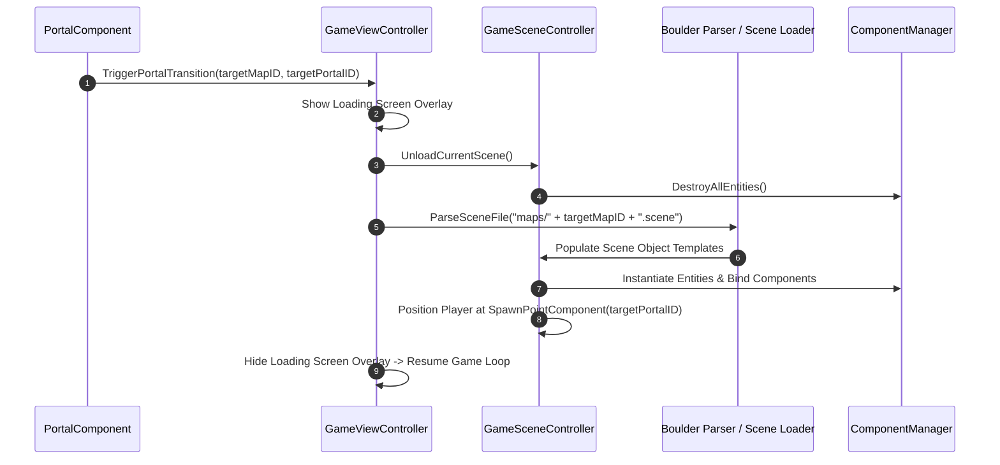

# Caver Scene Graph & World Node Management Documentation

## 1. System Overview & Purpose

The scene graph in Swordigo (`Caver::Scene`, `Caver::GameSceneController`, `Caver::MapNode`, `Caver::MapNode_Portal`, `Caver::ObjectTemplate`, `Caver::SpawnPointComponent`) manages level loading, spatial tree hierarchies, zone transitions, checkpoint spawn points, and seamless world streaming.

This document details scene file structures, map node linking, portal teleportation, object templates, and integration with **Boulder**.

---

## 2. Namespace & Class Hierarchy (`Caver::*`)

```
Caver::Scene (Master Scene Tree Node)
 ├── Caver::MapNode (Map Node Definition & World Map Location)
 │    └── Caver::MapNode_Portal (Level Gateway & Transition Teleporter)
 ├── Caver::ObjectTemplate (Entity Serialization Template)
 ├── Caver::SpawnPointComponent (Player Respawn Location Node)
 └── Caver::GameSceneController (Level Scene Loop & Active Node Runtime)
```

---

## 3. World Map Node Graph & Level Serialization

Swordigo's world is split into interconnected map nodes (e.g. `oakvale_town`, `cairnwood_forest`, `cairnwood_cave1`, `floren_town`, `snowypeak_mountain`).



### Map Node Data Schema Structure
```cpp
namespace Caver {
    struct PortalTarget {
        std::string targetMapID;      // e.g. "cairnwood_forest"
        std::string targetPortalID;   // Target spawn portal ID
        std::string requiredFlagKey;  // Optional quest unlock flag key
    };

    class MapNode {
    public:
        std::string mapID;
        std::string displayNameTextKey;
        std::string sceneFileName;     // e.g. "cairnwood_forest.scene"
        std::string bgmTrackName;      // e.g. "bgm_forest.ogg"
        glm::vec2 worldMapCoordinates;
        std::vector<PortalTarget> portals;
    };
}
```

---

## 4. Scene Loading & Entity Deserialization Pipeline

When entering a new map node via `PortalComponent` or main menu load:



---

## 5. Reverse Engineering & Tools Integration Notes

- **Boulder Map Editor**: Boulder is the primary reverse-engineered map editor for Swordigo. It parses, renders, and serializes `.scene` map files containing entity placement, polylines, portals, and object links.
- **SwKiWi API Modding**: SwKiWi exposes `GameSceneController::RegisterCustomMapNode`, enabling custom level mods and custom portal transitions.

---

## 6. PC Port (`swd`) Implementation Strategy

1. **JSON Scene Format**: Replace raw legacy `.scene` binary structures with human-readable JSON level files (`oakvale_town.json`).
2. **Background Asset Streaming**: Asynchronously load next level mesh and texture assets while player approaches portal trigger zones to minimize loading screen durations.
