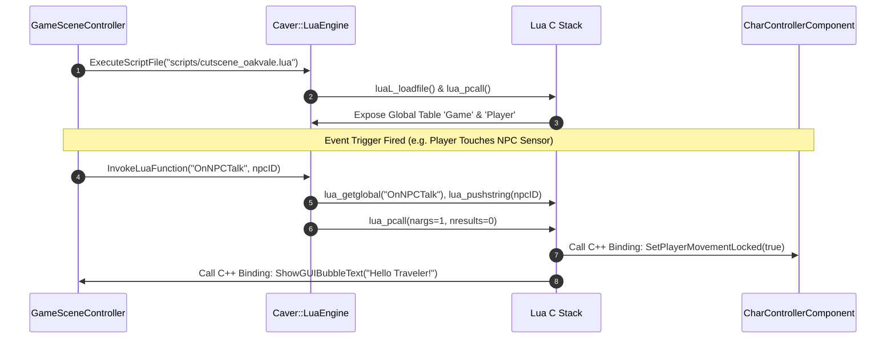

# Caver Lua Scripting Engine & API Bindings Documentation

## 1. System Overview & Purpose

The decompiled Ghidra source in `GhidraDecomp src/misc/lua_*` reveals an embedded **Lua 5.1** C API scripting runtime. Lua scripts drive cutscene camera paths, NPC conversation logic, puzzle state evaluation, achievement triggers, and modding API callbacks.

This document details the Lua C API integration, stack push/pop wrappers, global environment initialization, C++ object userdata metatables, and event script execution for the C++ PC rewrite.

---

## 2. Namespace & Lua C API Wrappers

```
Lua C API Subsystem (lua5.1)
 ├── State & Stack Management: lua_newstate, lua_close, lua_pushvalue, lua_settop
 ├── Environment & Tables: lua_createtable, lua_setfield, lua_getfield, lua_setmetatable
 ├── Function Execution: lua_pcall, lua_call, lua_cpcall, lua_resume, lua_yield
 ├── Auxiliary Library: luaL_newstate, luaL_openlib, luaL_loadfile, luaL_loadstring
 └── Custom Engine Bindings: Caver::LuaEngine, Caver::LuaScriptComponent
```

---

## 3. Lua Host Execution & C++ Binding Pipeline



---

## 4. Key Engine Lua C Bindings Catalog

### Exposed C++ Functions to Lua Runtime

| Lua Function Name | C++ Host Callback Function | Parameters | Engine Effect |
| :--- | :--- | :--- | :--- |
| `Game.PlayCutscene(id)` | `Caver::GameViewController::StartCutscene` | `string cutsceneID` | Locks player input, triggers camera spline path. |
| `Game.SetFlag(key, val)`| `Caver::GameData::SetFlag` | `string key, bool/int val` | Updates persistent save state flag register. |
| `Game.GetFlag(key)` | `Caver::GameData::GetFlag` | `string key` | Returns active flag value from save data. |
| `Game.OpenDoor(doorID)` | `Caver::DoorControllerComponent::OpenDoor` | `string doorID` | Plays door open animation and disables collider. |
| `Player.AddXP(amount)` | `Caver::HeroEntityComponent::AddExperience` | `int amount` | Grants experience points and checks level-up threshold. |
| `Player.Heal(hearts)` | `Caver::HealthComponent::Heal` | `int quarterHearts` | Restores player health hearts. |
| `Camera.Shake(intensity)`| `Caver::CameraController::TriggerShake` | `float intensity` | Triggers screen shake camera effect. |

---

## 5. Reverse Engineering & Tools Integration Notes

- **SwKiWi Modding API Integration**: SwKiWi exposes `LuaEngine::RegisterLuaBinding`, allowing mod creators to expose new C++ functions directly to Lua scripts for custom gameplay mods.
- **Boulder Map Editor**: Boulder embeds Lua script file references (`.lua`) inside `.scene` level properties for map triggers.

---

## 6. PC Port (`swd`) Implementation Strategy

1. **Upgrade to LuaJIT / Sol2**: Upgrade embedded Lua 5.1 to **LuaJIT** with modern **Sol2** C++17 binding templates for zero-overhead C++/Lua interoperability.
2. **Script Hot-Reloading**: Implement file system watcher delegates to automatically reload modified `.lua` scripts during development without restarting the game client.
