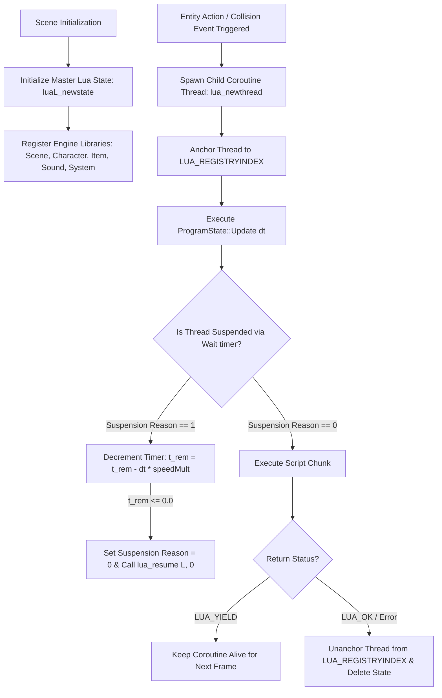

# Caver Scene Script Language (SCL) & Coroutine Scheduler Documentation

## 1. System Overview & Purpose

The Scene Script Language (SCL) is Swordigo's native scripting pipeline. SCL scripts drive level triggers, puzzle mechanisms, cutscene camera sequences, NPC interactions, and entity collision callbacks.

This document details the SCL Protobuf packaging format (`Caver::Program`), hierarchical coroutine thread scheduler (`Caver::ProgramState`), timer suspension mechanics, event trigger hooks, and schema-independent bytecode extraction algorithms for the C++ PC rewrite.

---

## 2. SCL Representation & Protobuf Schema (`Caver::Program`)

In the native C++ engine, SCL scripts are encapsulated by `Caver::Program` which maps to a Protobuf schema containing three primary fields:

```protobuf
message Program {
    optional string Name = 1;         // Script identifier (e.g. "oakvale_elder_cutscene")
    optional string Source = 2;       // Plaintext Lua source code
    optional bytes CompiledCode = 3;  // Precompiled binary Lua bytecode (\033Lua signature)
}
```

### Loading & Execution Pipeline
1. **Precompiled Bytecode Path**: If Field 3 (`CompiledCode`) is present, `Program::LoadIntoState` passes the buffer directly to `luaL_loadbuffer(L, code, len, "program")`.
2. **Dynamic Load-Time Compilation**: If only Field 2 (`Source`) is present, `Program::LoadFromProtobufMessage` spawns a transient Lua state, runs `luaL_loadstring`, and serializes the compiled chunk into binary bytecode via `lua_dump`.

---

## 3. Hierarchical Coroutine Scheduler (`Caver::ProgramState`)

Active scripts run on dedicated coroutine threads managed by `Caver::ProgramState`:



---

## 4. Event Trigger Callbacks

### 1. Action Triggers (`EntityActionComponent::Perform`)
Fired when player interacts with an interactive object (chests, switches, NPCs):
- Spawns child `ProgramState`.
- Pushes self entity (`SceneObject`) onto Lua stack.
- Invokes `ProgramState::Execute(state, 1)` $\to$ Executes script passing `self` parameter.

### 2. Collision Triggers (`CollisionShapeComponent::Perform`)
Fired on physics body overlap:
- Spawns child `ProgramState`.
- Pushes `self` entity, `other` colliding entity, and collision flag onto Lua stack.
- Invokes `ProgramState::Execute(state, 3)` $\to$ Runs Lua callback:
  ```lua
  function onCollision(self, other, isTrigger)
      if other:GetType() == "Player" then
          Game.ShowText("Entrance Locked!")
      end
  end
  ```

---

## 5. Schema-Independent Bytecode Extractor Algorithm

To ensure robust SCL script parsing independent of Protobuf tag variations across game updates:

```cpp
bool ExtractSCLBytecode(const uint8_t* buffer, size_t size, std::vector<uint8_t>& outBytecode) {
    size_t offset = 0;
    while (offset < size) {
        uint32_t tag = ReadVarint32(buffer, offset);
        uint32_t wireType = tag & 0x07;
        if (wireType == 2) { // Length-delimited string / bytes
            uint32_t length = ReadVarint32(buffer, offset);
            const uint8_t* payload = buffer + offset;
            offset += length;
            
            // Check for Lua Bytecode Header Signature (\033Lua -> 0x1B 0x4C 0x75 0x61)
            if (length >= 4 && payload[0] == 0x1B && payload[1] == 0x4C && payload[2] == 0x75 && payload[3] == 0x61) {
                outBytecode.assign(payload, payload + length);
                return true;
            }
        } else {
            SkipField(wireType, buffer, offset);
        }
    }
    return false;
}
```

---

## 6. PC Port (`swd`) Implementation Strategy

1. **Native Coroutine Threads**: Utilize C++17 `std::coroutine` or LuaJIT coroutines (`coroutine.create`/`coroutine.resume`) for zero-overhead script thread management.
2. **Schema-Independent Loader**: Implement the wire-2 scanner above to load all legacy `.scl` script files seamlessly without requiring manual protobuf tag updates.
