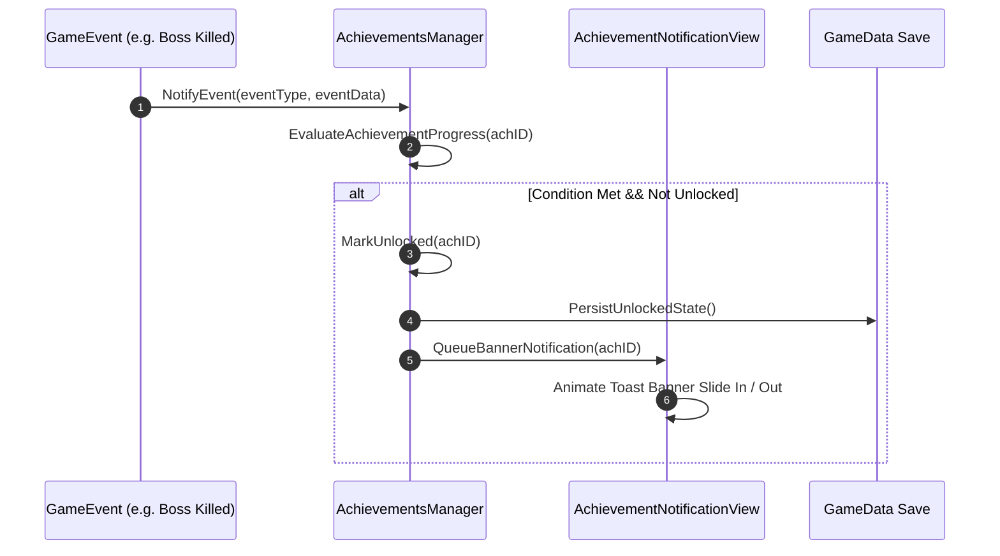

# Caver Achievements System Documentation

## 1. System Overview & Purpose

The Achievements System (`Caver::AchievementsManager`, `Caver::Achievement`, `Caver::AchievementNotificationView`, `Caver::OfflineAchievementsViewController`, `Caver::OfflineAchievementView`) tracks player accomplishments, boss clear milestones, secret chest discoveries, and level milestones.

This document specifies achievement tracking, notification banners, progress persistence, and offline fallback queues for the C++ PC rewrite.

---

## 2. Namespace & Class Hierarchy (`Caver::*`)

```
Caver::AchievementsManager (Master Achievement Evaluator)
 ├── Caver::Achievement (Achievement Record Definition)
 ├── Caver::AchievementNotificationView (In-Game Toast Banner Popup)
 ├── Caver::OfflineAchievementsViewController (Menu Achievements List)
 └── Caver::OfflineAchievementView (Single Achievement Entry View)
```

---

## 3. Achievements Catalog & Unlock Triggers

| Achievement ID | Display Title | Unlock Condition | Reward XP / Coins |
| :--- | :--- | :--- | :--- |
| `ach_first_blood` | **First Victory** | Defeat 1 enemy. | $50$ XP |
| `ach_treasure_hunter`| **Treasure Hunter** | Open 10 treasure chests. | $100$ XP, $100$ Coins |
| `ach_master_sword` | **Blade of Legend** | Obtain the Master Sword. | $250$ XP |
| `ach_boss_slayer` | **Corruptor Destroyer** | Defeat all 4 World Bosses. | $500$ XP, $500$ Coins |
| `ach_max_level` | **Ultimate Hero** | Reach character level 50. | $1000$ XP |

---

## 4. Notification Banner & Unlocking Pipeline



---

## 5. Reverse Engineering & Tools Integration Notes

- **Native SDK Reference**: Maps internal achievements to Google Play Games / Apple Game Center achievements.
- **SwKiWi API Modding**: SwKiWi exposes `AchievementsManager::RegisterCustomAchievement`, allowing mod creators to add custom achievements for custom quest mods.

---

## 6. PC Port (`swd`) Implementation Strategy

1. **Steam Achievements Integration**: Map `AchievementsManager::Unlock` directly to `SteamUserStats()->SetAchievement(achID)` for standard Steam PC releases.
2. **Custom Desktop Toast Notification**: Render high-resolution in-game toast banners with smooth slide-in / fade-out animations.
