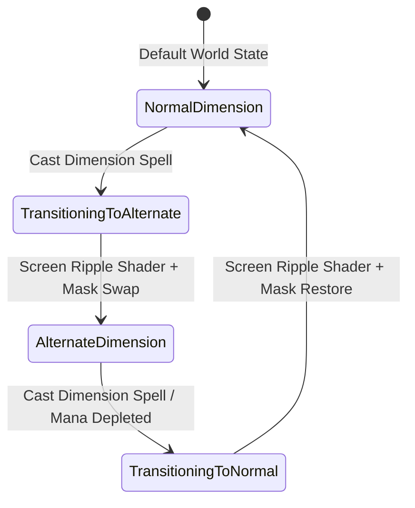

# Caver Magic & Spell System Documentation

## 1. System Overview & Purpose

The Magic and Spell System (`Caver::Skill`, `Caver::SkillComponent`, `Caver::MagicBoltComponent`, `Caver::MagicBombComponent`, `Caver::MagicHookshotComponent`, `Caver::DimensionSpellComponent`) manages player spell casting, mana consumption, projectile trajectory physics, hookshot tethering, and dimension realm shifting.

This document details spell mechanisms, mana cost formulas, dimension mechanics, and projectile state machines for the C++ PC rewrite.

---

## 2. Namespace & Class Hierarchy (`Caver::*`)

```
Caver::Skill (Base Spell Class Definition)
 ├── Caver::MagicBoltComponent (Ranged Arcane Projectile)
 ├── Caver::MagicBombComponent (Explosive Area-of-Effect Bomb)
 ├── Caver::MagicHookshotComponent (Tethering Physics Hook)
 └── Caver::DimensionSpellComponent (Alternate Dimension Realm Swap)

Caver::SkillComponent (Player Spell Cast Manager & Cooldown Controller)
Caver::SkillPickerView (GUI Quick-Select Radial / Grid View)
```

---

## 3. Spells Catalog & Casting Dynamics

### 1. Spell Parameters & Cost Table

| Spell Name | Skill ID | Mana Cost | Cooldown (sec) | Primary Mechanic |
| :--- | :--- | :--- | :--- | :--- |
| **Magic Bolt** | `spell_magic_bolt` | $15$ | $0.25\text{s}$ | Fires linear magic projectile; damages enemies and toggles distant switches. |
| **Magic Bomb** | `spell_magic_bomb` | $30$ | $0.80\text{s}$ | Spawns explosive bomb; breaks crumbling stone walls and damages grouped enemies. |
| **Magic Hookshot** | `spell_hookshot` | $25$ | $0.50\text{s}$ | Fires tether hook; pulls player to wooden surfaces / target rings or pulls small enemies. |
| **Dimension Rift** | `spell_dimension` | $40$ | $1.50\text{s}$ | Toggles alternate dimension realm; reveals hidden platforms, secret doors, and ethereal enemies. |

---

## 4. Dimension Realm Swapping State Machine (`DimensionSpellComponent`)

The Dimension Rift spell alters the active rendering context and physics collision layers across the entire scene:



### Dimension System Effects Specifications:
1. **Rendering Shader Mask**: Swaps background color palettes and applies screen distortion shader (`DimensionRippleProgram`).
2. **Entity Visibility & Collision Filter**: Entities marked with `DimensionObjectComponent` toggle collision shape masks:
   - Normal Dimension: Collider inactive (`Mask = 0x0000`), model alpha translucent.
   - Alternate Dimension: Collider active (`Mask = World Static`), model fully opaque.

---

## 5. Reverse Engineering & Tools Integration Notes

- **FileRift Asset Reference**: Dimension particle textures and spell mesh assets extracted via FileRift match skill IDs in `SkillComponent`.
- **SwKiWi API Modding**: SwKiWi exposes `SkillComponent::RegisterCustomSpell`, allowing custom magic spells (e.g. Frost Nova, Lightning Strike, Fireball) to be added to the player's spell repertoire.

---

## 6. PC Port (`swd`) Implementation Strategy

1. **Modern Shader Shifting**: Re-implement dimension realm transitions using GLSL/HLSL post-processing shaders for smooth screen distortion effects.
2. **Precise Hookshot Cable Rendering**: Draw hookshot tethering lines using dynamic multi-segment Bezier curve vertex arrays rather than static stretched quads.
