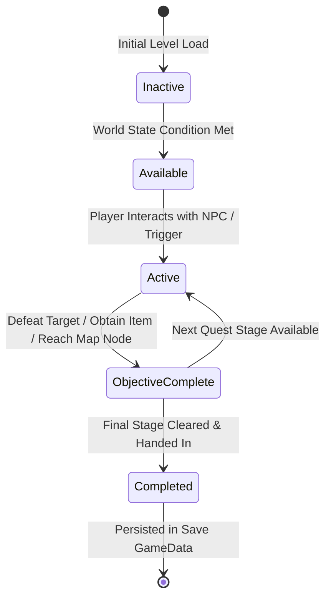

# Caver Quest & Progression System Documentation

## 1. System Overview & Purpose

The Quest and Progression System (`Caver::Quest`, `Caver::QuestState`, `Caver::QuestText`) handles main story objectives, side quest assignments, dialog condition checks, map progression barriers, and quest milestone rewards.

This document details the quest state machine, quest definition schemas, dialog branch triggers, and story progression handlers for the C++ PC rewrite.

---

## 2. Namespace & Class Hierarchy (`Caver::*`)

```
Caver::Quest (Master Quest Definition & Evaluation Node)
 ├── Caver::QuestState (Active Quest Objective Tracking Register)
 └── Caver::QuestText (Localized Quest Title, Description & Dialog Strings)
```

---

## 3. Quest Definition & State Machine

Every quest in Swordigo follows a formal multi-stage state machine:



### Quest Definition Schema Structure
```cpp
namespace Caver {
    enum class QuestStatus {
        Inactive,
        Available,
        Active,
        ObjectiveComplete,
        Completed
    };

    struct QuestStage {
        int stageIndex;
        std::string stageObjectiveTextKey;
        std::string requiredFlagKey; // e.g. "flag_hero_woke_up"
        std::string targetMapNode;     // Target map node indicator
        int rewardXP;
        int rewardCoins;
    };

    class Quest {
    public:
        std::string questID;           // e.g. "quest_find_master_sword"
        std::string titleTextKey;
        std::vector<QuestStage> stages;
        
        bool EvaluateAvailability(const GameData& gameData) const;
        bool EvaluateStageCompletion(int stageIndex, const GameData& gameData) const;
    };
}
```

---

## 4. Main Story Quests Catalog

1. **Wake Up & Visit Elder**:
   - **ID**: `quest_oakvale_elder`
   - **Objective**: Talk to Oakvale village elder to learn about the Corruptor threat.
2. **Retrieve Master's Sword**:
   - **ID**: `quest_master_sword`
   - **Objective**: Travel through Cairn Wood to the Master's Grave and retrieve the Master Sword.
3. **The Magic Bolt**:
   - **ID**: `quest_find_magic_bolt`
   - **Objective**: Defeat the Gargoyle in Cairn Wood Caves to unlock Magic Bolt spell.
4. **Forging the Mage Blade**:
   - **ID**: `quest_forge_mage_blade`
   - **Objective**: Collect the 3 Mage Blade Shards scattered across Snowy Peak, Fire Chamber, and Great Caves.

---

## 5. Reverse Engineering & Tools Integration Notes

- **Boulder Map Editor**: Boulder places NPC entities with quest trigger bindings (`QuestTriggerComponent`).
- **SwKiWi API Integration**: SwKiWi exposes `QuestManager::RegisterCustomQuest`, allowing modders to inject custom quest lines, dialog branches, and rewards.

---

## 6. PC Port (`swd`) Implementation Specs

1. **Event-Driven Quest Evaluator**: Replace polling quest condition updates with event-driven listener triggers (`OnFlagChanged`, `OnMonsterKilled`, `OnItemAcquired`).
2. **Localized Quest Text Database**: Store all quest titles and descriptions in clean UTF-8 JSON localization files (`quests_en.json`, `quests_es.json`).
