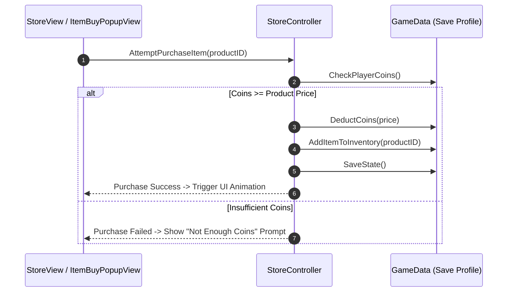

# Caver In-Game Store & Economy System Documentation

## 1. System Overview & Purpose

The In-Game Store and Economy System (`Caver::StoreController`, `Caver::StoreView`, `Caver::StoreProductView`, `Caver::ItemBuyPopupView`, `Caver::PurchaseViewController`) manages merchant shops, soul coin currency balances, item purchasing, health potion replenishments, and In-App Purchase (IAP) integration hooks.

This document specifies currency flow, store inventory catalogs, transaction validation, and UI popup workflows for the C++ PC rewrite.

---

## 2. Namespace & Class Hierarchy (`Caver::*`)

```
Caver::StoreController (Master Economy & Purchase Manager)
 ├── Caver::StoreController_Android (Android Google Play Billing Wrapper)
 ├── Caver::StoreView (Shop Merchant Full Screen GUI View)
 ├── Caver::StoreProductView (Individual Product Display Slot View)
 ├── Caver::ItemBuyPopupView (Confirmation Dialog Box Popup)
 └── Caver::PurchaseViewController (IAP Store Controller)
```

---

## 3. Store Inventory Catalog & Coin Pricing

### Merchant Shop Offerings Catalog

| Product ID | Display Name | Soul Coin Price | Category | Unlock Requirement |
| :--- | :--- | :--- | :--- | :--- |
| `shop_health_potion` | Health Potion | $50$ Coins | Consumable | None |
| `shop_broadsword` | Broadsword | $250$ Coins | Weapon | Reach Cairn Wood |
| `shop_iron_armor` | Iron Armor | $400$ Coins | Armor | Reach Great Caves |
| `shop_magic_ring` | Ring of Power | $600$ Coins | Trinket | Reach Master's Grave |
| `shop_heart_container`| Heart Container | $1000$ Coins | Permanent Stat | Unlocked after Boss 1 |

---

## 4. Transaction Validation & Purchase Workflow



---

## 5. Reverse Engineering & Tools Integration Notes

- **Native SDK Integration**: Platform-native SDK bindings (Google Play Billing / Apple IAP) in `StoreController_Android` are bypassed in the desktop build.
- **SwKiWi API Modding**: SwKiWi exposes `StoreController::RegisterCustomShopItem`, allowing custom mod merchants and unique items to be added to town shops.

---

## 6. PC Port (`swd`) Implementation Strategy

1. **Remove Mobile IAP Dependency**: Strip out all Google Play / App Store mobile billing routines in `StoreController_Android`. Convert all store items to be purchasable strictly via in-game Soul Coins.
2. **Merchant NPC Entity Binding**: Bind shop UI views directly to town merchant NPC interaction triggers via `StoreViewController`.
