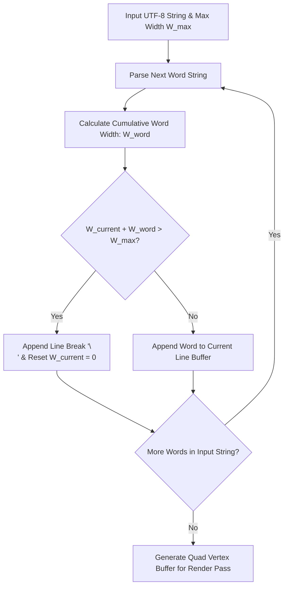

# Caver Font & Text Rendering Engine Documentation

## 1. System Overview & Purpose

The font rendering engine in Swordigo (`Caver::Font`, `Caver::Font_Glyph`, `Caver::FontText`, `Caver::GUILabel`) handles localized UTF-8 text parsing, glyph metrics evaluation, texture atlas UV mapping, line wrapping algorithms, dynamic label auto-scaling, and text shadow rendering.

This document details font atlas layouts, glyph metrics structures, line-wrapping algorithms, and internationalization (i18n) handling for the C++ PC rewrite.

---

## 2. Namespace & Class Hierarchy (`Caver::*`)

```
Caver::Font (Master Font Sheet & Texture Atlas Register)
 ├── Caver::Font_Glyph (Individual Character Glyph Metrics)
 ├── Caver::FontText (Text String Renderer Buffer)
 └── Caver::GUILabel (UI Text Label Node Container)
```

---

## 3. Glyph Metrics & Texture Atlas Mapping

Each font character glyph is defined by a `Font_Glyph` metrics descriptor:

```cpp
namespace Caver {
    struct Font_Glyph {
        uint32_t charCode;     // UTF-8 Unicode Codepoint (e.g. 0x0041 for 'A')
        float uvMinX, uvMinY;  // Texture atlas UV start coordinates
        float uvMaxX, uvMaxY;  // Texture atlas UV end coordinates
        float width, height;   // Pixel dimensions of glyph quad
        float bearingX;        // Horizontal offset from pen origin to glyph left edge
        float bearingY;        // Vertical offset from baseline to glyph top edge
        float advanceX;        // Horizontal distance to advance pen position for next glyph
    };
}
```

```
+-----------------------------------------------------------+
| (uvMinX, uvMinY) ----------+                              |
| |  [Glyph Texture Quad]   |                              |
| +------------------- (uvMaxX, uvMaxY)                     |
|                                                           |
| Pen Origin ----> [bearingX, bearingY] ----> [advanceX]    |
+-----------------------------------------------------------+
```

---

## 4. Text Layout & Word Wrapping Algorithm

`FontText` formats multi-line text strings (e.g., NPC dialog bubbles, quest descriptions) to fit within specified bounding box widths:



---

## 5. Reverse Engineering & Tools Integration Notes

- **FileRift Asset Extractor**: FileRift converts `.fnt` font definitions and texture sheets into desktop-compatible PNG font atlases.
- **SwKiWi Modding API**: SwKiWi exposes `FontManager::RegisterCustomFont`, allowing mod creators to add custom TTF/OTF fonts for modded UI menus.

---

## 6. PC Port (`swd`) Implementation Strategy

1. **FreeType / MSDF Dynamic Glyph Generation**: Replace fixed static texture atlases with **FreeType 2** or **Multi-channel Signed Distance Field (MSDF)** font rendering for razor-sharp text crispness at $4K$ desktop screen resolutions.
2. **UTF-8 Localization Support**: Support multi-language character sets (English, Spanish, French, German, Japanese, Chinese) seamlessly via UTF-8 string decoders.
