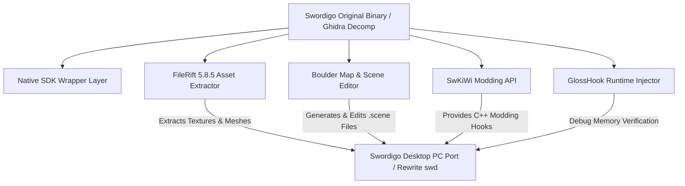

# Caver Reverse Engineering Tools & Ecosystem Integration Guide

## 1. System Overview & Purpose

This document provides a cross-reference integration guide linking Swordigo's game engine architecture (`Caver::*`) to reverse-engineering projects located within the `SwordigoTools` ecosystem:

1. **Native SDK (`Native_SDK-master`)**: Original platform integration layer and low-level asset loader references.
2. **FileRift (`FileRift5.8.5`)**: Multi-format asset decompressor and converter for PVR textures, POD 3D meshes, and compressed sound files.
3. **Boulder (`boulder-main`)**: Custom level and entity scene map editor.
4. **GlossHook (`GlossHook-*`)**: Dynamic ARM/x86 hooking engine for runtime function interception and memory modification.
5. **SwKiWi (`SwKiWi Source - RUBY EDITION`)**: Modern C++ modding API framework providing plugin loading and event hooks.

---

## 2. Tools Ecosystem Architecture Diagram



---

## 3. Tool Specifications & Integration Matrices

### 1. FileRift Asset Extractor (`FileRift5.8.5`)
- **Primary Function**: Asset unpacking and file format conversion.
- **Mapping to `Caver::*` Engine**:
  - `CPVRTModelPOD` $\to$ FileRift POD Converter $\to$ glTF 2.0 / OBJ 3D Meshes.
  - `PVRTTextureLoadFromPVR` $\to$ FileRift PVRTC/ETC1 Decompressor $\to$ RGBA PNG Textures.
  - Sound Bank Assets $\to$ FileRift Audio Unpacker $\to$ WAV / OGG Audio Streams.
- **PC Rewrite Usage**: Used during asset pipeline setup to extract original mobile assets into standard desktop formats for `swd`.

### 2. Boulder Level Editor (`boulder-main`)
- **Primary Function**: Visual 2.5D map editor for creating and editing `.scene` files.
- **Mapping to `Caver::*` Engine**:
  - Entity Placement $\to$ Creates `ObjectTemplate` and `ComponentCollection` definitions.
  - Terrain Polyline Editing $\to$ Serializes `GroundPolygonComponent` 2D vertex arrays.
  - Interactive Wiring $\to$ Binds `ObjectLinkControllerComponent` signals between switches and doors.
  - Teleport Portals $\to$ Configures `MapNode_Portal` link properties.
- **PC Rewrite Usage**: Primary tool for level design and custom map creation for the PC port.

### 3. SwKiWi Modding Framework (`SwKiWi`)
- **Primary Function**: Dynamic modding API and plugin loader framework.
- **Mapping to `Caver::*` Engine**:
  - `GameViewController::LoadGameState` $\to$ `SwKiWi::OnGameStateLoaded` Hook.
  - `ComponentFactory` $\to$ `SwKiWi::RegisterCustomComponent` API.
  - `HeroEquipmentManager` $\to$ `SwKiWi::RegisterCustomItem` API.
  - `StoreController` $\to$ `SwKiWi::RegisterCustomShop` API.
- **PC Rewrite Usage**: Serves as the native C++ modding interface for `swd`, allowing community mods without source re-compilation.

### 4. GlossHook Hooking Engine (`GlossHook`)
- **Primary Function**: Function interception and dynamic memory patching engine.
- **Mapping to `Caver::*` Engine**:
  - Intercepts `CharControllerComponent::ApplyImpulse` for custom physics modifiers.
  - Intercepts `PlayerProfile::Save` for cloud auto-sync verification.
  - Intercepts `RenderingContext::DrawMesh` for frame rate profiling and debug overlays.
- **PC Rewrite Usage**: Reference for verifying decompiled function signature parameters and behavioral contracts.

---

## 4. Complete PC Rewrite (`swd`) Development Workflow

```
1. Asset Extraction:
   FileRift -> Extract .POD & .PVR assets -> Output PNG & glTF files to /res/

2. Level Design:
   Boulder -> Edit / Create .scene level maps -> Save JSON scenes to /res/maps/

3. Core Engine Runtime (swd):
   Compile C++ PC Rewrite using GLFW/SDL2 + Vulkan/OpenGL -> Load assets & maps

4. Community Modding:
   SwKiWi API -> Load dynamic C++ plugins from /mods/ -> Extend gameplay mechanics
```
