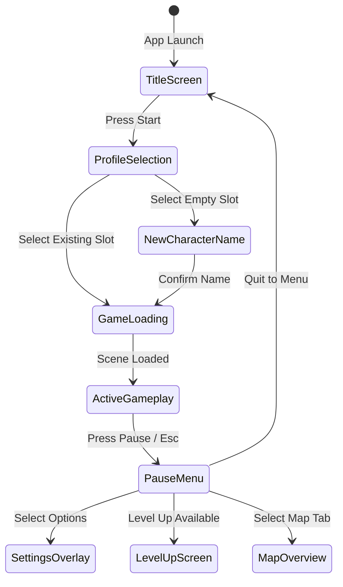

# Caver Menu Systems & View Controllers Documentation

## 1. System Overview & Purpose

The menu system (`Caver::MainMenuView`, `Caver::MainMenuViewController`, `Caver::PauseViewController`, `Caver::LevelUpViewController`, `Caver::ProfileSelectionViewController`, `Caver::CreditsViewController`, `Caver::TabbedMenuView`, `Caver::MapMenuPage`) manages main menu navigation stacks, setting toggles, save profile selection screens, character level-up attribute point allocation, and world map visualization.

This document details menu navigation stacks, view controller state transitions, level-up stat allocation logic, and map UI page rendering for the C++ PC rewrite.

---

## 2. Namespace & Class Hierarchy (`Caver::*`)

```
Caver::GUIViewController (Base View Controller Class)
 ├── Caver::MainMenuViewController (Title Screen & Sub-Menu Stack Controller)
 ├── Caver::ProfileSelectionViewController (Profile Slot 1, 2, 3 Selection Screen)
 ├── Caver::PauseViewController (In-Game Pause Overlay Controller)
 ├── Caver::LevelUpViewController (Character Attribute Point Spending Controller)
 ├── Caver::CreditsViewController (Scrolling Credits Controller)
 └── Caver::OnlineMenuViewController (Leaderboards & Achievements Menu Controller)

Caver::GUIView
 ├── Caver::MainMenuView (Main Menu Visual Root View)
 ├── Caver::NewMenuView (New Game Character Naming View)
 ├── Caver::SettingsView (Audio / Graphics Settings Panel)
 ├── Caver::TabbedMenuView (Multi-Tabbed Inventory & World Map Container)
 └── Caver::MapMenuPage (Interactive 2D World Map Page View)
```

---

## 3. Navigation View Controller Stack State Machine



---

## 4. Level-Up Attribute Allocation Logic (`LevelUpViewController`)

When player accumulates sufficient XP to level up (`player_xp >= player_xp_next_level`), `LevelUpViewController` presents the point spending interface:

```
+-------------------------------------------------------------------+
|                        LEVEL UP ACHIEVED!                         |
|                                                                   |
|  Unspent Attribute Points: [ 2 ]                                  |
|                                                                   |
|  Health (Max Hearts):    LVL 5  [ + ]  (+1/4 Heart Per Level)     |
|  Melee Attack (Sword):   LVL 8  [ + ]  (+4 Base Damage)           |
|  Magic Damage (Spells):  LVL 4  [ + ]  (+5 Spell Damage)          |
|                                                                   |
|                        [ CONFIRM SPENDING ]                       |
+-------------------------------------------------------------------+
```

### Stat Point Increment Formulas:
- **Health Level Up**: Increases max player health by 1 quarter-heart container ($0.25$ heart).
- **Melee Attack Level Up**: Increases sword base damage bonus by $+4.0$ damage units.
- **Magic Level Up**: Increases spell damage output by $+5.0$ damage units and accelerates mana regen rate by $+3\%$.

---

## 5. Reverse Engineering & Tools Integration Notes

- **Native SDK Reference**: Native UI view hierarchy wrappers for mobile devices.
- **SwKiWi Modding API**: SwKiWi exposes `MainMenuViewController::RegisterCustomSubMenu`, enabling custom settings panels (e.g. Graphics Preset Selectors, Keybind Mappers, Mod Manager UI).

---

## 6. PC Port (`swd`) Implementation Strategy

1. **Full Keyboard & Gamepad Menu Navigation**: Support seamless UI focus navigation (`GUIView::SetFocusedWidget`) using Arrow Keys, WASD, or Gamepad D-Pad with `Enter`/`Space`/`Button A` confirmation.
2. **Interactive Desktop World Map**: Render high-resolution world map textures on `MapMenuPage` with smooth zoom, pan, and interactive map node pins showing player location and quest objective icons.
