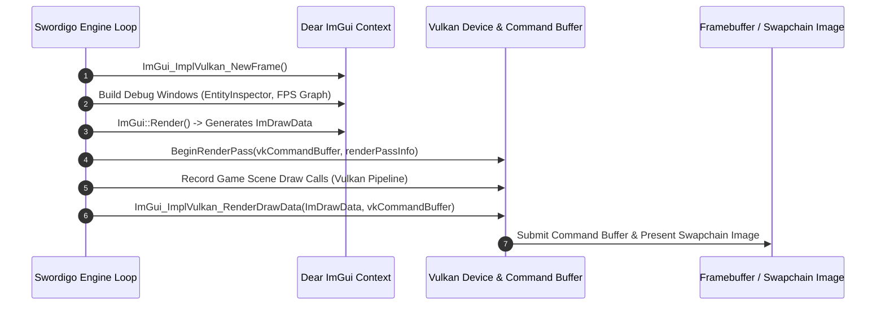

# Caver ImGui & Vulkan Backend Integration Documentation

## 1. System Overview & Purpose

The decompiled source in `GhidraDecomp src/TAKEFROMHER/imgui_impl_vulkan.cpp` and `.h` reveals the integration of **Dear ImGui** over a **Vulkan** graphics backend. This subsystem powers developer debug overlays, real-time entity inspectors, performance monitoring graphs, memory leak tracking, and map node teleportation toolbars for desktop PC development builds (`swd`).

This document details the Vulkan rendering pipeline integration, ImGui descriptor pools, render pass setup, frame buffering, and developer overlay tools for the C++ PC rewrite.

---

## 2. Namespace & Vulkan ImGui Backend Architecture

```
ImGui Subsystem (Dear ImGui)
 ├── Core Driver: ImGui_ImplVulkan_Init, ImGui_ImplVulkan_Shutdown
 ├── Frame Lifecycle: ImGui_ImplVulkan_NewFrame, ImGui_ImplVulkan_RenderDrawData
 ├── Memory Management: ImGui_ImplVulkan_CreateDeviceObjects, ImGui_ImplVulkan_DestroyDeviceObjects
 └── Developer Overlays:
      ├── EntityInspector (Inspect Entity Components & Transforms)
      ├── MemoryProfiler (Monitor Smart Pointer & Buffer Allocations)
      ├── MapTeleporter (Instant Scene Node Teleportation)
      └── FrameTimeGraph (FPS & Frame Time Performance Metrics)
```

---

## 3. Vulkan Render Pass & ImGui Command Buffer Pipeline



---

## 4. Vulkan Initialization Data Schema

The `ImGui_ImplVulkan_InitInfo` structure initializes the Vulkan backend:

```cpp
struct ImGui_ImplVulkan_InitInfo {
    VkInstance Instance;
    VkPhysicalDevice PhysicalDevice;
    VkDevice Device;
    uint32_t QueueFamily;
    VkQueue Queue;
    VkPipelineCache PipelineCache;
    VkDescriptorPool DescriptorPool;
    uint32_t MinImageCount;
    uint32_t ImageCount;
    VkSampleCountFlagBits MSAASamples;
    const VkAllocationCallbacks* Allocator;
    void (*CheckVkResultFn)(VkResult err);
};
```

---

## 5. Developer Debug Overlay Tools Matrix

| Debug Overlay Tool | ImGui Window Function | Primary Developer Use Case |
| :--- | :--- | :--- |
| **Entity Inspector** | `ShowEntityInspector()` | View active components, edit player position coordinates in real-time, toggle hitboxes. |
| **Map Teleporter** | `ShowMapTeleporter()` | Select any map node (`oakvale_town`, `snowypeak`) and instantly warp player. |
| **Stat Modifier** | `ShowPlayerStatEditor()` | Give soul coins, set player level, unlock all magic spells / swords for testing. |
| **Frame Time Profiler**| `ShowPerformanceProfiler()`| Graph CPU tick vs GPU draw time, monitor active particle counts and draw calls. |

---

## 6. Reverse Engineering & Tools Integration Notes

- **SwKiWi API Integration**: SwKiWi exposes `ImGui::GetMainDockSpace`, allowing C++ modders to add custom developer tools and UI panels directly into the debug overlay.
- **GlossHook Interception**: GlossHook uses ImGui overlays to display real-time memory hook status and function call counts.

---

## 7. PC Port (`swd`) Implementation Strategy

1. **Conditional Build Flag**: Wrap all ImGui debug overlays in `#ifndef NDEBUG` or `SWD_ENABLE_DEV_TOOLS` build flags to strip developer tools from production release builds.
2. **Vulkan Dynamic Rendering**: Upgrade `imgui_impl_vulkan` to support Vulkan 1.3 **Dynamic Rendering** (`VK_KHR_dynamic_rendering`), removing the need for legacy VkRenderPass objects.
